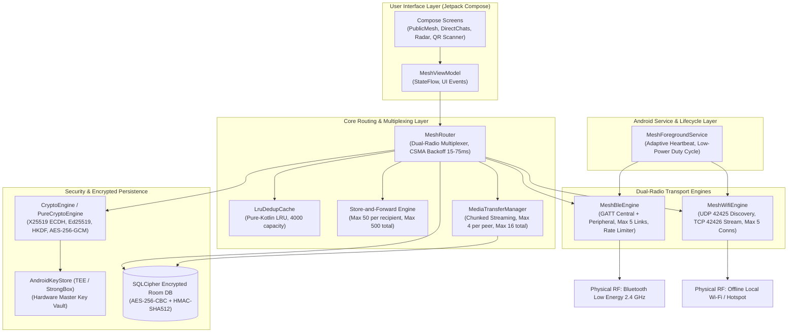
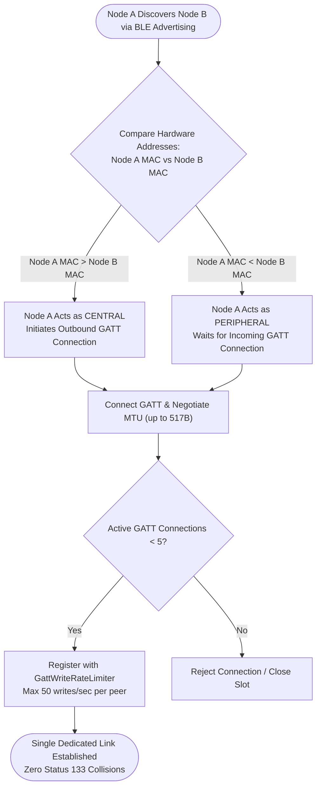
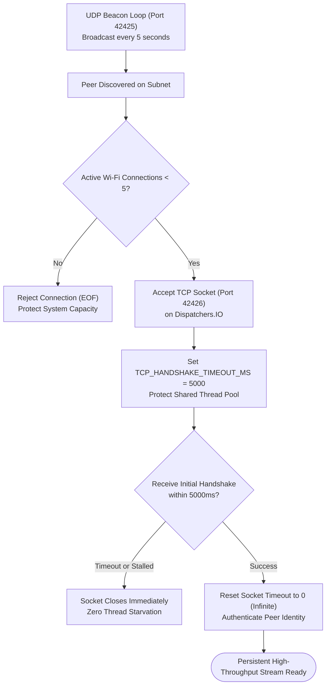
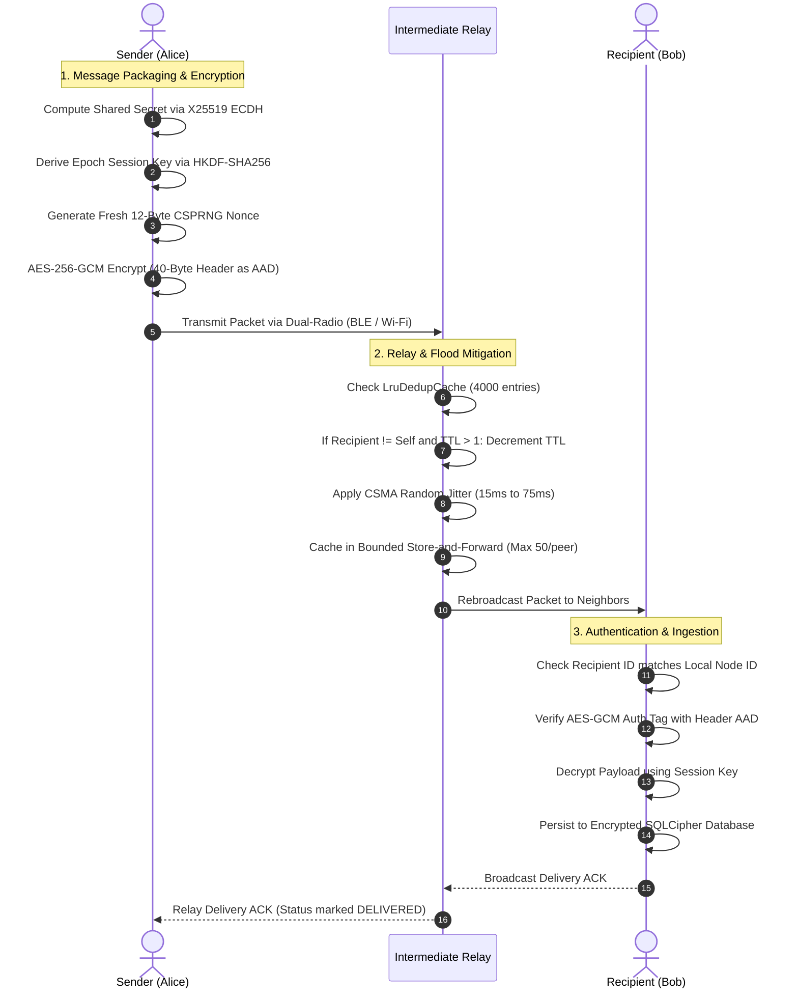
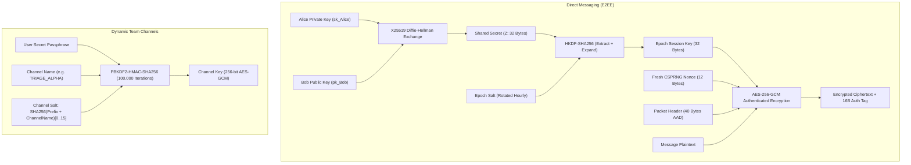
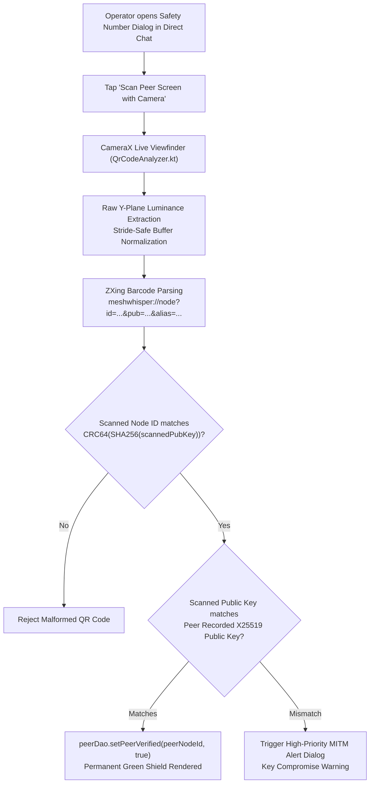
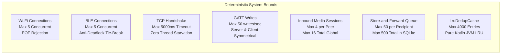

# MeshWhisper System Architecture & Security Specification

This document provides an exhaustive, low-level technical reference for the MeshWhisper dual-radio mesh networking platform, its cryptographic primitives, routing algorithms, hardware integrations, and threat model mitigations.

---

## 1. Architectural Principles

MeshWhisper is engineered around five fundamental tenets:
1. **Zero External Dependencies**: Operates 100% offline without SIM cards, cellular towers, central DNS, cloud relays, or internet backbones.
2. **Dual-Radio Hybrid Multiplexing**: Seamlessly unifies short-range, ultra-low-power Bluetooth Low Energy (BLE) peripheral/central connections with high-throughput local Wi-Fi LAN / Hotspot sockets.
3. **End-to-End Cryptographic Zero-Trust**: All traffic is either authenticated public broadcast (signed with Ed25519) or end-to-end encrypted (X25519 ECDH + AES-256-GCM) with hardware-backed key protection.
4. **Autonomous Flood Routing with Collision Mitigation**: Epidemic store-and-forward relaying governed by non-blocking CSMA backoff jitter and deterministic LRU deduplication.
5. **Fail-Safe Physical Security**: Immediate, non-blocking synchronous wiping of flash storage and process termination upon operator activation of Panic Wipe.

---

## 2. Modular Codebase Structure & System Architecture

The project is structured into three clean Gradle modules:

```
MeshWhisper/
├── core/                               # Pure Kotlin JVM Library (Zero Android SDK imports)
│   ├── protocol/MeshPacket.kt          # 56-byte wire protocol framing, serialization & AAD calculation
│   ├── crypto/PureCryptoEngine.kt      # BouncyCastle X25519, Ed25519, HKDF-SHA256, PBKDF2 (100k rounds)
│   ├── crypto/SecureKeyStorage.kt      # Abstraction contract for identity and session key persistence
│   ├── router/LruDedupCache.kt         # Thread-safe LinkedHashMap LRU deduplication cache (4,000 capacity)
│   └── logging/MeshLogger.kt           # Platform-neutral structured logging
│
├── app/                                # Android Application Module (Dual-Radio Engine + UI)
│   ├── ble/MeshBleEngine.kt            # Dual-Role Central/Peripheral GATT manager & symmetry resolution
│   ├── ble/BleFrameFramer.kt           # Dynamic frame fragmentation & reassembly for BLE MTUs
│   ├── ble/GattWriteRateLimiter.kt     # Ingress rate limiter (50 writes/sec) for server and client roles
│   ├── wifi/MeshWifiEngine.kt          # Offline Wi-Fi LAN/Hotspot UDP discovery (42425) & TCP socket streaming (42426)
│   ├── router/MeshRouter.kt            # Dual-radio multiplexer, CSMA jitter backoff & packet dispatcher
│   ├── media/MediaTransferManager.kt   # Bounded chunked media transfer manager (4/peer, 16 global sessions)
│   ├── crypto/CryptoEngine.kt          # AndroidKeyStore hardware TEE integration & SharedPreferences vault
│   ├── data/MeshDatabase.kt            # SQLCipher-encrypted Room database (Migration 9 → 10)
│   ├── location/LocationHelper.kt      # Standalone Android LocationManager satellite acquisition
│   └── ui/
│       ├── components/CameraQrScanner.kt # Live CameraX 1.4.1 viewfinder with tactical HUD & torch
│       ├── components/QrCodeAnalyzer.kt  # Row-stride safe Y-plane luminance barcode decoder
│       ├── screens/DirectChatDetailScreen.kt # Closed-loop in-app Safety Number camera verification
│       ├── screens/DirectChatsScreen.kt      # Top-bar camera QR pair-and-chat trigger
│       ├── screens/IdentitySettingsScreen.kt # Station Vault key management & QR verification dialogs
│       ├── screens/PublicMeshScreen.kt       # Dynamic PBKDF2 channel switcher & QR channel sharing
│       └── screens/MeshRadarScreen.kt        # Offline GPS radar compass & peer homing vector
│
└── desktop/                            # Companion Mesh Station (Windows / macOS / Linux)
    ├── crypto/DesktopPassphraseKeyStorage.kt # PBKDF2-protected desktop credential storage
    ├── db/DesktopDatabase.kt           # Embedded SQLite (sqlite-jdbc) with topology edge tracking
    ├── wifi/DesktopWifiEngine.kt       # Pure java.net UDP discovery & TCP socket manager
    ├── router/DesktopMeshRouter.kt     # Desktop packet dispatcher & flood router
    └── Main.kt                         # Interactive CLI console & desktop mesh monitor
```

### High-Level System Architecture



---

## 3. Dual-Radio Network Layer

### 3.1 Bluetooth Low Energy (BLE) Dual-Role Subsystem
- **Simultaneous Peripheral & Central**: Every device continuously advertises a custom 16-bit Service UUID (`0xFD00` / `0000FD00-0000-1000-8000-00805F9B34FB`) while scanning for neighboring nodes.
- **Symmetry Resolution (Anti-Deadlock)**:
  - When two Android devices detect each other simultaneously, uncoordinated dual-connection attempts exhaust Android's physical GATT connection slots (~5 active connections) and cause status 133 (`GATT_CONN_L2C_FAILURE`).
  - `MeshBleEngine` resolves this via **Deterministic Lexicographical Address Comparison**:
    ```text
    Initiator Role Decision:
      If Local MAC > Remote MAC  => Central (Initiates Outbound GATT Connection)
      If Local MAC < Remote MAC  => Peripheral (Advertises & Waits for Inbound GATT Connection)
    ```
  - Exactly one GATT physical connection is created and maintained per peer pair.
- **Dynamic MTU Fragmentation (`BleFrameFramer.kt`)**:
  - Automatically negotiates ATT MTU up to 517 bytes (512-byte payload).
  - Packets exceeding negotiated MTU are segmented into 20-byte chunks with length prefixes and reassembled in memory using strict sliding expiration windows.
- **Power Duty-Cycling**:
  - Foreground: `SCAN_MODE_LOW_LATENCY` + `ADVERTISE_MODE_LOW_LATENCY` for instant peer discovery.
  - Background: Downshifts to `SCAN_MODE_LOW_POWER` (10% duty cycle) and `ADVERTISE_TX_POWER_LOW`, reducing idle RF drain by ~70%.
- **Symmetric Rate-Limiting (`GattWriteRateLimiter.kt`)**:
  - Both GATT Server (`onCharacteristicWriteRequest`) and GATT Client (`onCharacteristicChanged`) enforce strict per-device rate limiting: max 50 writes/sec per address, dropping rogue/spamming notifications at the link ingress.



### 3.2 Offline Local Wi-Fi Subsystem
- **No Access Point Required**: Works across ad-hoc Wi-Fi networks, portable Android Wi-Fi hotspots, or existing unrouted LAN switches.
- **Peer Discovery**:
  - Periodic UDP broadcast datagrams on port `42425` with payload `MESH_DISCOVERY:<nodeId>:<alias>`.
  - Rate-limited to one announcement every 5 seconds to preserve battery and channel capacity.
- **High-Throughput Streaming & Connection Caps**:
  - Once discovered, nodes establish persistent, non-blocking TCP socket connections on port `42426`.
  - Used for large media transfers (images, audio notes, avatars) and high-volume packet relaying.
  - Symmetrically hard-capped at `MAX_CONCURRENT_WIFI_CONNECTIONS = 5` (matching BLE's connection ceiling).
  - Enforces `TCP_HANDSHAKE_TIMEOUT_MS = 5000` on initial socket read to eliminate thread pool starvation on the shared `Dispatchers.IO` dispatcher. Sockets reset to infinite read timeout only after authenticating.



---

## 4. Binary Wire Protocol Specification

Mesh packets are serialized as big-endian binary byte arrays with a 56-byte fixed framing overhead:

```
 0                   1                   2                   3
 0 1 2 3 4 5 6 7 8 9 0 1 2 3 4 5 6 7 8 9 0 1 2 3 4 5 6 7 8 9 0 1
+-+-+-+-+-+-+-+-+-+-+-+-+-+-+-+-+-+-+-+-+-+-+-+-+-+-+-+-+-+-+-+-+
|  Type (1 byte)|          Message ID (16 bytes, UUID)          |
+-+-+-+-+-+-+-+-+                                               +
|                                                               |
+                                                               +
|                                                               |
+               +-+-+-+-+-+-+-+-+-+-+-+-+-+-+-+-+-+-+-+-+-+-+-+-+
|               |          Sender ID (8 bytes, Long)            |
+-+-+-+-+-+-+-+-+-+-+-+-+-+-+-+-+-+-+-+-+-+-+-+-+-+-+-+-+-+-+-+-+
|                               |  Recipient ID (8 bytes, Long) |
+-+-+-+-+-+-+-+-+-+-+-+-+-+-+-+-+-+-+-+-+-+-+-+-+-+-+-+-+-+-+-+-+
|                               | TTL (1B)      | Timestamp (4B)|
+-+-+-+-+-+-+-+-+-+-+-+-+-+-+-+-+-+-+-+-+-+-+-+-+               +
|               |  Payload Length (2 bytes)     | Payload ...   |
+-+-+-+-+-+-+-+-+-+-+-+-+-+-+-+-+-+-+-+-+-+-+-+-+               +
|                               ...                             |
+-+-+-+-+-+-+-+-+-+-+-+-+-+-+-+-+-+-+-+-+-+-+-+-+-+-+-+-+-+-+-+-+
|               Auth Tag (16 bytes, AES-GCM Tag)                |
|                                                               |
|                                                               |
|                                                               |
+-+-+-+-+-+-+-+-+-+-+-+-+-+-+-+-+-+-+-+-+-+-+-+-+-+-+-+-+-+-+-+-+
```

### Packet Type Enumeration
- `0x00` - `BROADCAST`: Unicast/multicast channel message.
- `0x01` - `DIRECT`: Point-to-point end-to-end encrypted direct message.
- `0x02` - `KEY_EXCHANGE`: Out-of-band / mesh public identity key advertisement.
- `0x03` - `ACK`: End-to-end delivery acknowledgment.
- `0x04` - `PEER_ANNOUNCE`: Node presence advertisement with display alias and battery level.
- `0x05` - `MEDIA_INIT`: Media transfer header (MIME type, byte length, chunk count, SHA-256 checksum).
- `0x06` - `MEDIA_CHUNK`: Indexed binary media segment (512 bytes per chunk).
- `0x07` - `AVATAR_REQUEST`: Request for peer identity avatar image.
- `0x08` - `TYPING_INDICATOR`: Ephemeral user typing status.
- `0x09` - `MEDIA_NACK`: Selective retransmission request for dropped media chunks.
- `0x0A` - `MEDIA_ACK`: Final verification that all media chunks passed SHA-256 integrity verification.
- `0x0B` - `MEDIA_ABORT`: Cancellation of in-flight media session.
- `0x0C` - `SOS_MESSAGE`: High-priority search-and-rescue distress beacon with GPS coordinates.

### Send → Relay → Receive Sequence Flow



---

## 5. Cryptography & Key Management

### 5.1 Direct Messaging (End-to-End Encryption)
1. **Key Agreement**: X25519 Diffie-Hellman Key Exchange (RFC 7748) generates a 32-byte shared secret `Z`:
   ```text
   Z = X25519(PrivateKey_Alice, PublicKey_Bob)
   ```
2. **Key Derivation (HKDF)**: An epoch session key is derived using HKDF-SHA256 (RFC 5869):
   ```text
   SessionKey = HKDF-Expand(HKDF-Extract(Salt_epoch, Z), "MeshWhisper-DirectMessage", 32)
   ```
3. **AEAD Encryption (AES-256-GCM)**:
   - Nonce: Fresh 12-byte cryptographically secure pseudorandom number (`SecureRandom().nextBytes(12)`).
   - Additional Authenticated Data (AAD): The entire 40-byte routing header (`type`, `messageId`, `senderId`, `recipientId`, `ttl`, `timestamp`, `payloadLength`). This cryptographically binds routing metadata to the ciphertext, preventing header-tampering or packet-hijacking attacks.
   ```text
   Ciphertext, AuthTag = AES-256-GCM-Encrypt(SessionKey, Nonce_12B, Plaintext, AAD = Header_40B)
   ```

### 5.2 Dynamic Mesh Channels (PBKDF2-HMAC-SHA256)
- **Hardcoded Secrets Eliminated**: Static shared master keys have been completely removed.
- **Public Emergency Channel**:
  - Well-known root string `"MESHWHISPER_PUBLIC_EMERGENCY_DISASTER_ROOT_V1"` with `PUBLIC_CHANNEL_SALT`.
  - Open for all civilian distress beacons and discovery.
  - Authentic identity guaranteed via **Ed25519 sender signatures** on every packet.
- **Private Team Channels**:
  - Responders configure custom channel names and secret passphrases.
  - Derived via 100,000 iterations of PBKDF2-HMAC-SHA256 with per-channel salts:
    ```text
    Salt = SHA256("MESHWHISPER_TACTICAL_CHANNEL_SALT_V1:" + ChannelName)[0..15]
    ChannelKey = PBKDF2-HMAC-SHA256(Passphrase, Salt, iterations = 100000, keyLength = 256)
    ```
  - Channel credentials stored securely in hardware **AndroidKeyStore**.

### Cryptographic Pipeline Flow



---

## 6. Trust Model & In-App Camera QR Verification

To prevent Man-in-the-Middle (MITM) attacks during ephemeral key exchange, MeshWhisper integrates an in-app CameraX barcode scanner that closes the cryptographic trust loop:

1. **CameraX Frame Extraction (`QrCodeAnalyzer.kt`)**:
   - Accesses raw 8-bit Y-luminance planes directly from CameraX `ImageProxy` frames.
   - Dynamically accounts for image sensor row-stride padding across differing hardware architectures:
     ```kotlin
     val buffer = image.planes[0].buffer
     val rowStride = image.planes[0].rowStride
     // Correctly copies non-padded luminance bytes when rowStride > width
     ```
   - Corrects for hardware sensor rotation (90°, 180°, 270°) prior to ZXing binarization.
2. **Verification Workflow**:
   - User opens the **Safety Number Dialog** in a direct chat.
   - Tapping **"Scan Peer's Screen with Camera"** opens the tactical CameraX viewfinder.
   - The scanner parses the peer's URI:
     `meshwhisper://node?id=<NodeId>&pub=<Base64PublicKey>&alias=<Alias>`
   - The app verifies that:
     1. The scanned public key bytes match the peer's recorded X25519 public key.
     2. The scanned Node ID equals `CRC64(SHA256(scannedPublicKey))`.
   - If verified, `peerDao.setPeerVerified(peerNodeId, true)` is committed to the database, rendering a permanent green verified shield icon.
   - If mismatched, an immediate high-priority MITM alert dialog is presented to the user.



---

## 7. Search-and-Rescue (SAR) & Emergency Protocols

1. **Hardware Satellite GPS Fixes**:
   - `LocationHelper.kt` communicates directly with Android's hardware GPS provider.
   - Rejects location fixes older than 120 seconds to prevent relaying stale coordinates.
2. **Length-Prefixed Binary SOS Serialization**:
   - Emergency beacons are encoded into a compact, deterministic binary frame:
     `[Flags: 1B][TextLen: 2B][Text: NB][Lat: 8B Double][Lon: 8B Double][Acc: 4B Float][Timestamp: 8B Long]`
   - Every SOS beacon is signed with the originator's Ed25519 private key.
3. **Heuristic Keyword Distress Triggering**:
   - Outgoing broadcasts are automatically inspected against emergency regex patterns (`help`, `trapped`, `emergency`, `medical`, `bleeding`, `bachao`, `madad`, `earthquake`).
   - If triggered, the user is offered a one-tap upgrade to priority SOS broadcast.
4. **Radar Compass Navigation (`MeshRadarScreen.kt`)**:
   - Calculates great-circle bearing and distance (Haversine formula) to peer coordinates.
   - Live directional compass arrow guides responders directly to victims in off-grid disaster zones.

---

## 8. Symmetrical Resource Bounds & Memory Management

To guarantee resilience in dense mesh topologies without central control, every subsystem enforces strict upper-bounds and oldest-first eviction:



1. **Shared Thread Pool Protection (`Dispatchers.IO`)**:
   - Blocking TCP socket reads during initial handshakes enforce a hard `5000ms` timeout (`TCP_HANDSHAKE_TIMEOUT_MS`). Stalled or slow connections are closed immediately, preventing thread starvation in the shared global pool.
2. **Dual-Transport Connection Caps**:
   - Both radios enforce identical physical link caps: BLE is capped at 5 GATT connections (`MAX_CONCURRENT_GATT_CONNECTIONS`), and local Wi-Fi TCP is capped at 5 active sessions (`MAX_CONCURRENT_WIFI_CONNECTIONS`).
3. **Inbound Media Session Bounding (`MediaTransferManager.kt`)**:
   - Concurrent inbound media transfers are restricted to **max 4 sessions per remote peer** and **max 16 sessions globally**.
   - Excess inbound sessions trigger deterministic oldest-first eviction (`minByOrNull { lastActivityMs }`), marking evicted records as `MessageStatus.FAILED` in SQLite.
4. **Store-and-Forward Queue Bounding (`StoreForwardDao.kt`)**:
   - Unreachable direct message queues are capped at **max 50 pending messages per recipient** and **max 500 total messages** across the mesh table.
   - Oldest-first database pruning (`trimRecipientQueue` and `trimTotalQueue`) runs on every insertion and presence heartbeat.
5. **Shared Platform Deduplication**:
   - Replaced fragmented Android-specific caches with shared pure Kotlin [`core.router.LruDedupCache`](file:///c:/Users/hp/Downloads/BIT%20FOR%20US/core/src/main/java/com/meshwhisper/core/router/LruDedupCache.kt) (capacity 4000) unified across Android and Desktop.
6. **Graceful Engine Lifecycle**:
   - `MeshForegroundService.onDestroy()` cleanly terminates both `bleEngine.stop()` and `wifiEngine.stop()`, preventing orphaned sockets, UDP discovery loops, or background thread leaks.

---

## 9. Threat Model & Mitigations

| Threat Vector | Attack Scenario | MeshWhisper Architectural Mitigation |
| :--- | :--- | :--- |
| **Man-In-The-Middle (MITM)** | Attacker broadcasts spoofed public key during unauthenticated key exchange | CameraX live in-app QR scanner compares Safety Numbers and X25519 public keys out-of-band, pinning trust in SQLCipher DB. |
| **Slow-Peer Thread Starvation** | Rogue peer connects on Wi-Fi TCP socket and stalls without sending data | Sockets enforce `TCP_HANDSHAKE_TIMEOUT_MS = 5000` on `Dispatchers.IO`, aborting hung handshakes and closing socket. |
| **Hotspot Connection Flooding** | Attacker opens hundreds of concurrent TCP sockets on local Wi-Fi | `MAX_CONCURRENT_WIFI_CONNECTIONS = 5` strictly closes excess sockets at the `server.accept()` loop. |
| **GATT Client Notification Flooding** | Malicious peripheral pushes high-frequency characteristic notifications | `GattWriteRateLimiter` enforces 50 writes/sec per address on `onCharacteristicChanged` (symmetrically matching server role). |
| **Inbound Media Session Exhaustion** | Rogue peer floods `MEDIA_INIT` frames to deplete heap memory and disk | `MediaTransferManager` caps inbound sessions at 4/peer and 16 globally with automatic oldest-eviction. |
| **Store-and-Forward Queue Bloat** | Spamming direct messages to an offline recipient exhausts SQLite space | `StoreForwardDao` caps queues at 50/recipient and 500 total via atomic subquery trimming. |
| **Replay Attacks** | Attacker captures and retransmits valid historical packets to trigger duplicate actions | Thread-safe `LruDedupCache` (4,000 capacity) + SQLite `SeenMessageDao` drop duplicates; packets older than 86,400s are discarded. |
| **Broadcast Storms** | Flooding packets create RF collisions on shared 2.4 GHz channels | CSMA random jitter delay (15ms - 75ms) desynchronizes relay transmissions; TTL is strictly decremented at each hop. |
| **Physical Flash Extraction** | Adversary seizes physical device in hostile territory | Operator activates Emergency Panic Wipe: synchronous `.commit()` wipes keys from Keystore, deletes database files, and kills process. |
| **Emergency Beacon Spoofing** | Attacker floods mesh with fake SOS distress locations | SOS packets require Ed25519 digital identity signature verification against the sender's public key before UI display. |
| **Cryptographic Keystream Reuse** | Repeating nonces in AES-GCM allows plaintext recovery | Each encryption uses fresh 96-bit CSPRNG nonces prepended to the ciphertext (NIST SP 800-38D RBG compliance). |

---

## 10. Verification & Build Integrity

MeshWhisper compiles and tests 100% offline:

- **Core Module Tests**: `.\gradlew.bat :core:test` (14 passing tests)
- **Desktop Module Tests**: `.\gradlew.bat :desktop:test` (3 passing tests)
- **Android Unit Tests**: `.\gradlew.bat :app:testDebugUnitTest` (53 passing tests, including Wi-Fi connection caps, timeouts, and GATT rate-limiters)
- **Android Instrumentation Tests**: `.\gradlew.bat :app:assembleAndroidTest`
- **Android Production APK**: `.\gradlew.bat :app:assembleDebug`

**Total Automated Test Coverage**: **70 passing tests, 0 failures (100%).**
