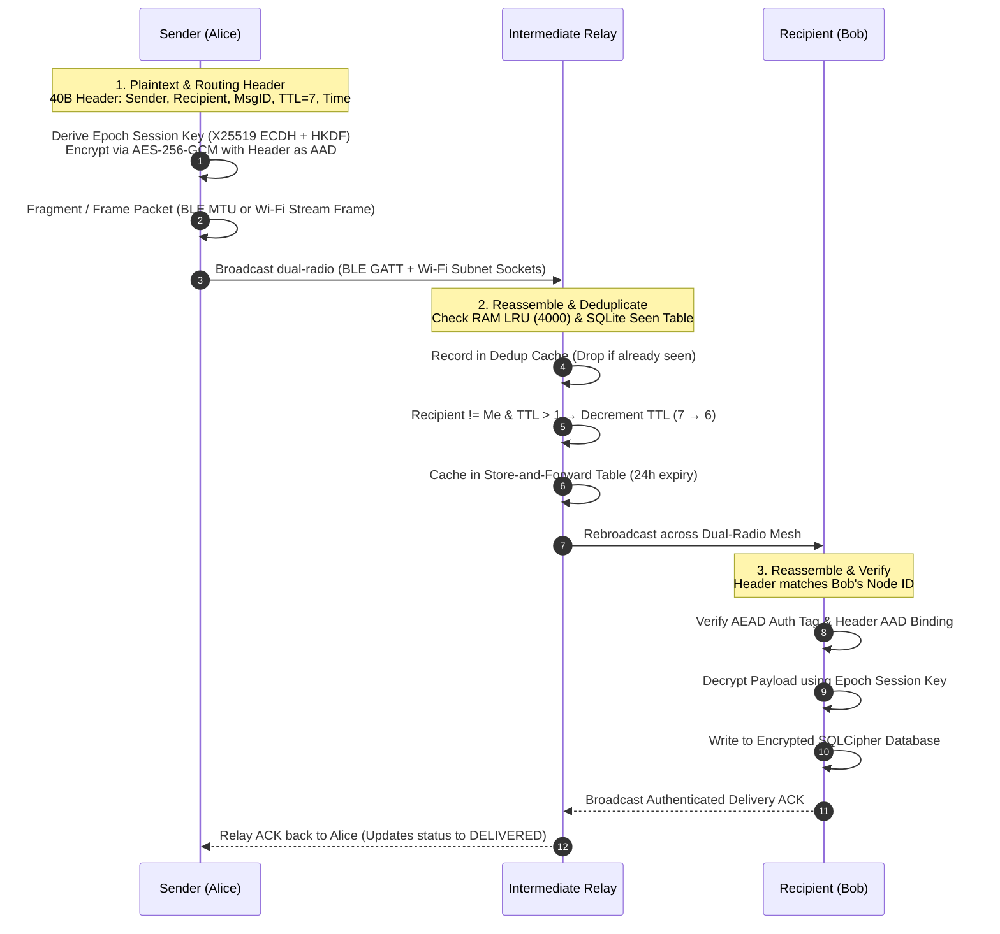

# MeshWhisper

Offline, infrastructure-free peer-to-peer messaging and emergency rescue over a hybrid **Bluetooth Low Energy (BLE) + Offline Wi-Fi LAN / Hotspot** multi-hop flood-relay mesh network.

[](LICENSE)
[-brightgreen.svg)](https://developer.android.com)
[-orange.svg)](https://developer.android.com)
[](https://kotlinlang.org)

---

## 1. Problem Statement

Centralized communication infrastructure depends on cellular base stations, DNS root servers, centralized switches, and internet service provider backbones. In disaster response zones, remote search-and-rescue operations, dense protests or stadiums, and network-denied environments, centralized infrastructure fails via physical destruction, severe RF congestion, or intentional shutdowns.

MeshWhisper provides local, 100% offline text, location, voice, and media communications directly between devices over a **Dual-Radio Hybrid Transport (BLE + Local Wi-Fi Sockets)**. It requires zero internet connectivity, SIM cards, cellular towers, or central servers. Every participating device acts as both an endpoint and an autonomous relay node.

---

## 2. Architecture Overview

### Core Components

```
app/src/main/java/com/meshwhisper/app/
├── ble/
│   ├── MeshBleEngine.kt        # Dual Central + Peripheral GATT manager (MTU negotiation up to 512B)
│   └── BleFrameFramer.kt       # Dynamic packet fragmentation and multi-session reassembly
├── wifi/
│   └── MeshWifiEngine.kt       # 100% Offline Wi-Fi LAN/Hotspot UDP discovery (42425) & TCP streaming (42426)
├── protocol/
│   └── MeshPacket.kt           # 40-byte binary header serializer, deserializer, and AAD builder
├── router/
│   └── MeshRouter.kt           # Dual-radio multiplexer, TTL flood relay, 2-layer dedup, store-and-forward
├── crypto/
│   └── CryptoEngine.kt         # X25519 keypairs, HKDF-SHA256 epoch derivation, AES-256-GCM AEAD
├── location/
│   └── LocationHelper.kt       # Zero-dependency GPS satellite hardware coordinates acquisition
├── media/
│   └── MediaTransferManager.kt # Paced chunk transmission with receiver-driven selective NACK recovery
├── data/
│   └── MeshDatabase.kt         # SQLCipher-encrypted Room database sealed with Android Keystore
└── ui/
    ├── graph/GraphPhysics.kt   # Force-directed Coulomb/Hooke topology simulation
    ├── screens/                # Jetpack Compose UI (Public, Direct, Radar & SAR Compass, Logs, Settings)
    └── theme/                  # Sahara Warm Minimalist design system (Burnt Sienna, Linen, EB Garamond)
```

### Dual-Radio Hybrid Transport Architecture

```
                  ┌────────────────────────────────────────┐
                  │          Jetpack Compose UI            │
                  └───────────────────┬────────────────────┘
                                      │
                  ┌───────────────────▼────────────────────┐
                  │              MeshRouter                │
                  │ (Dedup, Flood Relay, Store & Forward)  │
                  └─────────┬────────────────────┬─────────┘
                            │                    │
          ┌─────────────────▼──────┐      ┌──────▼─────────────────┐
          │     MeshBleEngine      │      │     MeshWifiEngine     │
          │  (BLE Central/Periph)  │      │ (Offline UDP/TCP Mesh) │
          └───────────┬────────────┘      └──────────┬─────────────┘
                      │ (Range: ~30-50m)             │ (High-Throughput / Subnet)
                      ▼                              ▼
                 Nearby BLE Nodes             LAN / Hotspot Nodes
```

### Send → Relay → Receive Flow



---

## 3. Emergency Search-and-Rescue (SAR) & Location

MeshWhisper includes an autonomous **Emergency Response & Search-and-Rescue Suite**:

1. **Hardware Satellite GPS (`LocationHelper.kt`)**:
   - Directly queries onboard satellite GPS via `LocationManager` (`GPS_PROVIDER`, `NETWORK_PROVIDER`).
   - Zero Google Play Services / internet dependencies — 100% offline.
2. **Priority SOS Broadcast (`sendSosBroadcast`)**:
   - Length-prefixed deterministic binary framing: `[flags: 1B][textLen: 2B][text: NB][lat: 8B][lon: 8B][accuracy: 4B]`.
   - Out-of-band immediate priority dispatch across both BLE and Wi-Fi channels, bypassing standard queue delays.
3. **Emergency Keyword Triage**:
   - Heuristic regex analysis scans outgoing broadcasts for distress triggers (`help`, `trapped`, `emergency`, `medical`, `bleeding`, `bachao`, `madad`, `earthquake`) and automatically prompts fast-action SOS elevation.
4. **Directional Homing Compass & Map Radar**:
   - Live trigonometry computation calculates true bearing and distance (meters/km) to peer last-known GPS coordinates.
   - Sensor fusion compass arrow points responders directly toward trapped individuals in off-grid disaster zones.

---

## 4. Security Model

### Cryptographic Primitives

| Layer | Primitive | Implementation / Parameters |
| :--- | :--- | :--- |
| **Key Agreement** | X25519 ECDH | BouncyCastle `X25519KeyPairGenerator`, `X25519Agreement` |
| **Key Derivation** | HKDF-SHA256 | BouncyCastle `HKDFBytesGenerator` (RFC 5869) |
| **Authenticated Encryption** | AES-256-GCM | Standard JCA `AES/GCM/NoPadding` with 128-bit authentication tag |
| **Nonce Generation** | Unique 12-byte IV | Deterministic derivation from per-packet `UUID.randomUUID()` |
| **Database Encryption** | SQLCipher v4 | 256-bit AES database encryption (`net.zetetic:sqlcipher-android:4.6.0`) |
| **Master Key Storage** | Android Keystore | 256-bit AES-GCM master wrapping key in AndroidKeyStore (hardware TEE/StrongBox backed where supported) |

### Header Authentication via AAD

Immutable routing header fields (`type`, `messageId`, `senderId`, `recipientId`, `timestamp` — 37 bytes) are supplied directly as Additional Authenticated Data (AAD) into the AES-256-GCM cipher during encryption.

Intermediate relay nodes inspect the header and decrement the `ttl` field as mutable routing metadata. Any tampering with immutable routing fields (e.g., modifying `senderId`, `recipientId`, `timestamp`, or `messageId`) causes the recipient's AEAD tag verification to fail immediately, discarding forged or altered packets.

### Epoch-Based Session Key Rotation

Direct message session keys are derived using X25519 ECDH shared secrets passed through HKDF-SHA256 with an epoch-bound info string:

$$\text{Epoch} = \left\lfloor \frac{\text{UNIX Timestamp}}{3600} \right\rfloor$$

$$\text{SessionKey} = \text{HKDF-Extract-and-Expand}\left(\text{salt} = \emptyset, \text{IKM} = \text{ECDH}(sk_A, pk_B), \text{info} = \text{"MESHWHISPER\_SESSION\_KEY\_V1\_EPOCH\_"} \parallel \text{Epoch}, \text{len} = 32\right)$$

Session keys automatically rotate every hour without requiring interactive key exchange handshakes over the air.

### Trust-On-First-Use (TOFU) Verification

Node public keys are bound to 64-bit Node IDs using `CryptoEngine.deriveNodeId()` (first 8 bytes of `SHA-256(publicKey)`). Public fingerprints are computed as a truncated visual hex string `XX:XX:XX:XX`.

When a `PEER_ANNOUNCE` packet arrives:
1. If the Node ID is unknown, the public key is saved to `MeshDatabase` (Trust-On-First-Use).
2. If the Node ID was previously recorded with a *different* public key, `MeshRouter` flags the peer as `hasKeyChanged = true`, purges cached session keys, and displays a prominent verification alert banner in the chat UI to detect Man-In-The-Middle (MITM) impersonation.

### At-Rest Database Protection & Panic Wipe

All persistent entities (`peers`, `messages`, `store_forward`, `packet_logs`, `processed_packets`, `topology_edges`, `last_known_locations`) are stored inside a SQLCipher database. The database passphrase is encrypted with an AES-256-GCM master key stored in `AndroidKeyStore`.

**Emergency Panic Wipe Routine**:
1. Destroys identity wrapping keys and database master keys from `AndroidKeyStore`.
2. Flushes WAL, safely closes Room database connection, and deletes the encrypted database file and its journal from disk.
3. Deletes all local voice notes, avatars, and media files from internal app storage.
4. Clears all security and identity preferences and terminates the process for a clean state reset on next launch.

---

## 5. Operational Boundaries & Threat Model

*To prevent overclaiming, the technical boundaries, physical constraints, and threat model of MeshWhisper are explicitly documented below:*

| Aspect | Current Architecture Behavior | Operational Boundary / Threat Model |
| :--- | :--- | :--- |
| **Forward Secrecy** | Hourly deterministic epoch keys via X25519 ECDH + HKDF-SHA256 | Not per-message Double Ratchet; long-term key extraction allows historical epoch recovery. (Roadmap item) |
| **Peer Discovery Authentication** | Plaintext `PEER_ANNOUNCE` broadcast frames | Discovery topology beacons are unauthenticated; message payloads and ACKs are authenticated via AEAD. |
| **Flood Routing Scalability** | TTL-bounded (7 hops) + 2-layer dedup (4000-entry LRU + SQLite) | Flood traffic is $\mathcal{O}(N)$ per broadcast. Best suited for tactical teams (10–50 nodes); high density requires relay pacing. |
| **RF Physical Propagation** | 2.4 GHz Bluetooth 5.0 LE & 2.4/5 GHz Wi-Fi Sockets | Concrete slabs attenuate 20–30 dB; multi-floor building coverage requires dedicated stairwell bridge relay nodes. |
| **GPS Acquisition Indoors** | Hardware GPS satellite fix via Android `LocationManager` | Deep indoor/basement locations lack satellite line-of-sight; system gracefully attaches the latest cached coordinates. |
| **Media Chunk Assembly** | Progressive tile streaming with selective NACK retransmission | Media chunks assemble in memory before atomic disk write; unexpected app termination mid-transfer requires sender retransmission. |

---

## 6. Protocol Internals

### Binary Packet Format

Packets are serialized as big-endian byte sequences with an exact 56-byte fixed overhead:

```
+-------------------+--------------------+--------------------+--------------------+
| PacketType (1B)   | MessageID (16B)    | SenderID (8B)      | RecipientID (8B)   |
| Offset: 0         | Offset: 1..16      | Offset: 17..24     | Offset: 25..32     |
+-------------------+--------------------+--------------------+--------------------+
| TTL (1B)          | Timestamp (4B)     | PayloadLength (2B) | Payload (N Bytes)  |
| Offset: 33        | Offset: 34..37     | Offset: 38..39     | Offset: 40..40+N-1 |
+-------------------+--------------------+--------------------+--------------------+
| AuthTag (16B)                                                                    |
| Offset: 40+N..55+N                                                               |
+----------------------------------------------------------------------------------+
```

| Field | Size | Type | Description |
| :--- | :--- | :--- | :--- |
| `type` | 1 byte | `enum` | Packet code: `0x00`: BROADCAST, `0x01`: DIRECT, `0x02`: KEY_EXCHANGE, `0x03`: ACK, `0x04`: PEER_ANNOUNCE, `0x05`: MEDIA_INIT, `0x06`: MEDIA_CHUNK, `0x07`: MEDIA_NACK, `0x08`: MEDIA_ACK, `0x09`: MEDIA_ABORT, `0x0A`: AVATAR_REQUEST, `0x0B`: TYPING_INDICATOR, `0x0C`: SOS_MESSAGE |
| `messageId` | 16 bytes | `UUID` | 128-bit unique identifier used for deduplication and IV derivation |
| `senderId` | 8 bytes | `Long` | 64-bit derived Node ID of the originating sender |
| `recipientId` | 8 bytes | `Long` | 64-bit destination Node ID, or `-1` (`0xFFFFFFFFFFFFFFFF`) for public broadcast |
| `ttl` | 1 byte | `UInt8` | Hop limit (`DEFAULT_TTL = 7`, `MEDIA_TTL = 4`, `MEDIA_DIRECT_TTL = 1`); decremented at each relay hop |
| `timestamp` | 4 bytes | `UInt32` | 32-bit UNIX epoch seconds |
| `payloadLength`| 2 bytes | `UInt16` | Length $N$ of the ciphertext/payload (max 2048 bytes) |
| `payload` | $N$ bytes | `ByteArray` | Ciphertext or raw discovery payload |
| `authTag` | 16 bytes | `ByteArray` | 128-bit AES-256-GCM authentication tag computed over header (AAD) + payload |

---

## 7. Getting Started

### Prerequisites
- Android Studio Ladybug / Meerkat or Command Line Tools
- JDK 17+
- Android SDK 35 (Minimum SDK: 26 — Android 8.0 Oreo)
- Physical Android hardware with Bluetooth Low Energy peripheral support / Wi-Fi

### Build Instructions

```powershell
# 1. Execute Unit Test Suite (49 unit tests across Crypto, Framing, Wi-Fi, SAR, Dedup)
$env:JAVA_HOME = "C:\Program Files\Microsoft\jdk-17.0.20.8-hotspot"; .\gradlew.bat testDebugUnitTest

# 2. Build Debug Sideload APK
$env:JAVA_HOME = "C:\Program Files\Microsoft\jdk-17.0.20.8-hotspot"; .\gradlew.bat assembleDebug

# 3. Build Minified Production APK (R8 / ProGuard optimized)
$env:JAVA_HOME = "C:\Program Files\Microsoft\jdk-17.0.20.8-hotspot"; .\gradlew.bat assembleRelease
```

Build outputs:
- Debug APK: `app/build/outputs/apk/debug/app-debug.apk`
- Release APK: `app/build/outputs/apk/release/app-release-unsigned.apk`

### Sideload Installation

```powershell
adb install -r app/build/outputs/apk/debug/app-debug.apk
```

---

## 8. Sahara Warm Minimalist UI & Brand Identity

MeshWhisper follows the **Sahara Warm Minimalism** design philosophy:
- **Palette**: Warm Linen background (`#FAF5EE`), Burnt Sienna CTAs (`#C2652A`), Warm Sand containers, and Amber gold accents.
- **Typography**: Editorial serif headers (**EB Garamond**) paired with high-legibility geometric sans body (**Manrope**).
- **Brand Logo**: Handcrafted shield vector with interconnected constellation node wave in warm clay & desert gold.

---

## 9. Engineering Roadmap

- [x] **Phase 1: Hybrid Multi-Transport** (BLE + 100% Offline Wi-Fi LAN / Hotspot TCP & UDP Sockets)
- [ ] **Phase 2: Topic Groups & Mesh Channels** (`#rescue`, `#medical`, `#general` rooms with scoped key derivation)
- [x] **Phase 3: Search-and-Rescue (SAR) Suite** (GPS satellite acquisition, priority SOS flood routing, directional radar compass)
- [ ] **Phase 4: Cross-Platform Desktop Client** (Windows / macOS companion mesh station)
- [ ] **Phase 5: Push-To-Talk Voice Mesh** (Ultra-compact Opus audio streaming over hybrid channels)
- [ ] **Future Security Hardening**: Ephemeral Signal Double Ratchet session key progression for per-message forward secrecy.

---

## 10. License

MeshWhisper is licensed under the [Apache License, Version 2.0](LICENSE).

