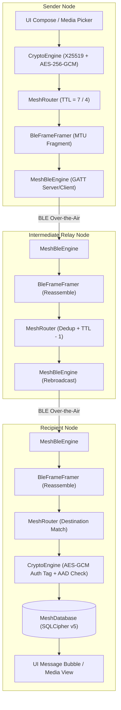

# MeshWhisper

Offline, serverless peer-to-peer messaging for Android over Bluetooth Low Energy (BLE) multi-hop mesh networks.

---

## 1. Problem and Motivation

In disaster response scenarios, remote field operations, crowded events, or connectivity-denied environments, cellular towers and internet backbones frequently fail or become inaccessible. MeshWhisper provides decentralized text and multimedia communication across nearby Android devices without requiring Wi-Fi access points, cellular data, SIM cards, or central servers.

---

## 2. Key Features

- **Multi-Hop Flood Routing**: Messages relay through intermediate devices, allowing two phones out of direct Bluetooth range to communicate.
- **End-to-End Encryption**: 1-to-1 direct messages are encrypted with ephemeral session keys derived via X25519 and HKDF-SHA256.
- **Authenticated Additional Data (AAD)**: Routing headers are cryptographically bound to the AES-256-GCM authentication tag to prevent tampering by relay nodes.
- **Encrypted Local Storage**: Local SQLite data (messages, contacts, telemetry) is encrypted at rest using SQLCipher with keys wrapped in the Android Keystore.
- **TOFU Identity Verification**: Alerts users when a contact's public key fingerprint changes from what was previously observed.
- **Interactive Web-of-Nodes Canvas**: Force-directed topology visualization rendered in real time from a decentralized neighbor-gossip protocol extension.
- **Bandwidth-Protected Multimedia**: Chunked, paced transfer of voice notes (AAC, ≤30s) and compressed images (JPEG, ≤60KB).
- **Two-Layer Replay Protection**: Fast in-memory LRU cache (4,000 entries) coupled with a persistent database replay table.
- **Store-and-Forward for DMs**: Caches undelivered direct messages for up to 24 hours on relay nodes until the recipient announces presence.
- **Panic Duress Wipe**: Hardware and software identity key purge with cryptographic database zeroization.

---

## 3. Architecture Overview

### Main Components
- **`MeshBleEngine`** (`ble/MeshBleEngine.kt`): Manages simultaneous BLE Central (scanning, GATT client) and Peripheral (advertising, GATT server) roles, dynamic MTU negotiation (up to 512 bytes), and tracks live direct GATT links (`connectedNodeIds`).
- **`BleFrameFramer`** (`ble/BleFrameFramer.kt`): Handles MTU-bounded chunk fragmentation and multi-session packet reassembly over physical BLE connections.
- **`MeshRouter`** (`router/MeshRouter.kt`): Orchestrates deduplication, hop decrementing, store-and-forward queueing, neighbor-gossip encoding, and packet dispatching.
- **`CryptoEngine`** (`crypto/CryptoEngine.kt`): Manages X25519 identity keypairs, hourly epoch session key derivation, AES-256-GCM AEAD encryption/decryption, and Keystore master key wrapping.
- **`MediaTransferManager`** (`media/MediaTransferManager.kt`): Handles image compression (max 640px, JPEG quality 50), voice recording (AAC 24kbps), paced chunk transmission (70ms delay), and out-of-order in-memory chunk reassembly.
- **`GraphPhysics`** (`ui/graph/GraphPhysics.kt`): Pure-Kotlin force-directed physics engine computing Coulomb repulsion, Hooke's spring attraction, and velocity damping for the topology canvas.
- **`MeshDatabase`** (`data/MeshDatabase.kt`): SQLCipher-backed Room database storing `PeerEntity`, `MessageEntity`, `StoreForwardEntity`, `PacketLogEntity`, `ProcessedPacketEntity`, and `TopologyEdgeEntity`.

### Message Flow (Compose to Display)
1. **Compose**: User sends a direct message or media item in `DirectChatDetailScreen`.
2. **Encrypt**: `CryptoEngine` derives an epoch-bound AES-256 symmetric session key using the recipient's X25519 public key and encrypts the payload with AES-256-GCM, generating a 16-byte authentication tag and binding routing headers as AAD.
3. **Transmit**: `MeshRouter` constructs a `MeshPacket` (`TTL = 7`), serializes the binary frame (40-byte header + payload + 16-byte auth tag), and passes it to `BleFrameFramer` to fragment across negotiated BLE MTU frames.
4. **Relay**: Neighboring nodes receive frames via `MeshBleEngine`, reassemble the `MeshPacket`, verify timestamp freshness (±10 min window), and check the two-layer deduplication cache. If not the recipient and `TTL > 1`, the relay decrements TTL and re-broadcasts over BLE.
5. **Decrypt & Display**: The destination node decrypts the payload with its private session key, verifies the AEAD auth tag against the header bytes, persists the message to `MeshDatabase`, and updates the Compose UI.



---

## 4. Security Model

### Cryptographic Primitives
- **Identity & Key Exchange**: X25519 Elliptic Curve Diffie-Hellman (ECDH) implemented via BouncyCastle (`X25519KeyPairGenerator`, `X25519Agreement`).
- **Key Derivation**: HKDF-SHA256 (`HKDFBytesGenerator`) with epoch-bound info context (`"MESHWHISPER_SESSION_KEY_V1_EPOCH_<epoch>"`) rotating session keys every hour (3600 seconds).
- **Authenticated Symmetric Encryption**: AES-256-GCM (`AES/GCM/NoPadding`, 128-bit authentication tag) via Java Cryptography Architecture (JCA).
- **Nonce / IV Generation**: 12-byte initialization vectors derived uniquely per transmission from `messageId` (UUID). Every single packet (including media chunks) generates a fresh, independent `UUID.randomUUID()`, preventing AES-GCM nonce reuse.
- **At-Rest Storage Encryption**: 256-bit SQLCipher (`net.zetetic:sqlcipher-android:4.6.0`) database encryption with passphrase wrapped in Android Keystore (`AndroidKeyStore`, StrongBox/TEE backed).

### What is Encrypted vs. Plaintext
- **Encrypted**:
  - `DIRECT_MESSAGE` payloads (end-to-end encrypted with peer session key).
  - `MEDIA_INIT` and `MEDIA_CHUNK` payloads (end-to-end encrypted for DMs; community-key encrypted for public broadcast).
  - `BROADCAST_MESSAGE` payloads (encrypted with shared community key derived from static salt).
- **Plaintext (Unencrypted, but Authenticated)**:
  - 40-byte routing headers: `type` (1B), `messageId` (16B), `senderId` (8B), `recipientId` (8B), `ttl` (1B), `timestamp` (4B), `payloadLength` (2B).
  - *Header Authentication*: Headers are fed directly into AES-GCM as Additional Authenticated Data (AAD). If an intermediate relay tampers with routing fields (such as `senderId` or `timestamp`), the recipient's AEAD tag check fails and the packet is dropped.
  - `PEER_ANNOUNCE` payloads: `alias` (string), `publicKey` (32B), and `neighborNodeIds` (8B * N) are unencrypted to enable discovery and topology mapping.

### TOFU (Trust-On-First-Use) Protection
When a node receives a `PEER_ANNOUNCE`, it hashes the 32-byte public key to derive a 64-bit Node ID and a SHA-256 visual safety number (`XX:XX:XX:XX`). If a previously seen Node ID broadcasts a new public key, `MeshRouter` flags `hasKeyChanged = true`, invalidates cached session keys, and displays an in-chat security warning banner to prevent impersonation attacks.

---

## 5. How the Mesh Works

MeshWhisper uses a **TTL-based flood-relay** architecture. It does not maintain dynamic routing tables or compute shortest paths.

### Relay Mechanics
1. When a packet is broadcast over BLE, every reachable node receives and parses it.
2. The node evaluates its **Two-Layer Deduplication Cache**:
   - *Layer 1 (Fast RAM)*: 4,000-entry `LruCache` keyed by `"${messageId}:${packetType}"`.
   - *Layer 2 (Persistent)*: `processed_packets` SQLite table.
   If the packet was previously observed, it is dropped immediately to prevent broadcast loops.
3. If the packet is not addressed to the receiving node (or is a broadcast), and `packet.ttl > 1`, the receiving node decrements the TTL by 1 (`packet.ttl - 1`) and rebroadcasts the raw binary frame to its local BLE neighborhood.

### Protocol Parameters
- **`DEFAULT_TTL = 7`**: Text messages traverse up to 6–7 serial hops.
- **`MEDIA_TTL = 4`**: Lower TTL specifically for media chunks to limit mesh saturation.
- **`CHUNK_PAYLOAD_SIZE = 1800` bytes**: Maximum raw media slice per `MEDIA_CHUNK` packet (fits within `MAX_PAYLOAD_SIZE = 2048`).
- **Transmission Pacing**: Outbound media chunks are paced with a `70ms` inter-chunk delay, with concurrency capped to 1 active media transfer per device.

*Tradeoff Note*: Flood routing trades bandwidth efficiency for absolute architectural simplicity and resilience against node mobility. It requires no route discovery handshakes and has no single point of failure, but scales with $O(N)$ transmissions per message across the network.

---

## 6. Multi-Floor / Large-Venue Deployment Guide

Bluetooth Low Energy (2.4 GHz) signals travel 10–30 meters line-of-sight in open corridors, but suffer extreme signal attenuation through reinforced concrete and rebar floor slabs (often dropping signal strength below receiver sensitivity in under 2 meters of solid concrete).

```
[4th Floor: Room 402] ───BLE───▶ [Stairwell Bridge Node #4]
                                            │ (Open stair airgap)
                                            ▼
[3rd Floor: Lab 301]  ◀───BLE─── [Stairwell Bridge Node #3]
                                            │
                                            ▼
[2nd Floor: Aud-2]    ◀───BLE─── [Stairwell Bridge Node #2]
                                            │
                                            ▼
[1st Floor: Lobby]    ◀───BLE─── [Stairwell Bridge Node #1]
```

### Deployment Recommendations:
- **Station Stairwell Bridge Nodes**: Place a dedicated phone running MeshWhisper at each staircase landing. Stairwells provide an open vertical air corridor allowing BLE packets to hop between floors without penetrating solid slab.
- **Avoid Elevator Shafts**: Metallic elevator cabs and reinforced counterweight shafts act as Faraday cages that block 2.4 GHz RF propagation.
- **Disable OS Battery Optimization**: Ensure bridge devices have battery optimization set to **Unrestricted** (`Settings -> Apps -> MeshWhisper -> Battery -> Unrestricted`). This prevents Android OEM background execution limits from killing the foreground BLE service.
- **TTL Budgeting**: With `DEFAULT_TTL = 7`, a message can traverse up to 6 intermediate relays. For venues exceeding 5 floors, ensure bridge nodes are placed directly along vertical stairwell axes to minimize wasted horizontal hops.
- **Pre-Event Validation Protocol**: Send a test text from the top floor to the ground floor. Verify that the received message bubble displays `⚡ X hops (Relayed)`, confirming multi-hop propagation.

---

## 7. Getting Started

### Prerequisites
- Android Studio Ladybug / Meerkat (or JDK 17+)
- Android SDK 35 (Minimum SDK: 26 — Android 8.0 Oreo)
- Physical Android device with Bluetooth Low Energy support (emulators cannot test real BLE mesh functionality)

### Required Android Permissions
Configured in `app/src/main/AndroidManifest.xml`:
- `android.permission.BLUETOOTH_SCAN` (`neverForLocation` flag on API 31+)
- `android.permission.BLUETOOTH_ADVERTISE`
- `android.permission.BLUETOOTH_CONNECT`
- `android.permission.FOREGROUND_SERVICE` & `FOREGROUND_SERVICE_CONNECTED_DEVICE`
- `android.permission.RECORD_AUDIO` (for voice notes)
- `android.permission.WAKE_LOCK`

### Build Instructions

```powershell
# 1. Run Unit Tests (Crypto, Routing, Deduplication, Graph Physics, Media)
.\gradlew.bat testDebugUnitTest

# 2. Build Sideloadable Debug APK
.\gradlew.bat assembleDebug

# 3. Build Minified Release APK (R8 / ProGuard enabled)
.\gradlew.bat assembleRelease
```

Debug APK output location: `app/build/outputs/apk/debug/app-debug.apk`

### Sideloading to Device
```powershell
adb install -r app/build/outputs/apk/debug/app-debug.apk
```

---

## 8. Known Limitations

- **Flood Scalability**: Because every packet is relayed by every node in range until TTL expires, total radio channel utilization grows with $O(N)$ per transmission. Deployments with dozens of concurrent active talkers in dense RF environments will experience packet collisions.
- **Live-Only Media Transfers**: To prevent intermediate relay devices from filling their encrypted databases with large binary chunks, `MEDIA_INIT` and `MEDIA_CHUNK` packets are **excluded from the store-and-forward queue**. If the recipient is offline when media is sent, the transfer will not be delivered later.
- **In-Memory Chunk Buffering**: Inbound media chunk reassembly occurs in RAM before writing the finalized file to private storage. If the app process is terminated mid-transfer, in-flight chunks are lost and must be re-sent.
- **Concrete Penetration**: BLE signals cannot reliably penetrate reinforced concrete floor slabs without dedicated bridge nodes placed in open air corridors.

---

## 9. License

This project is licensed under the Apache License 2.0 / MIT License. (See repository root for license details).
