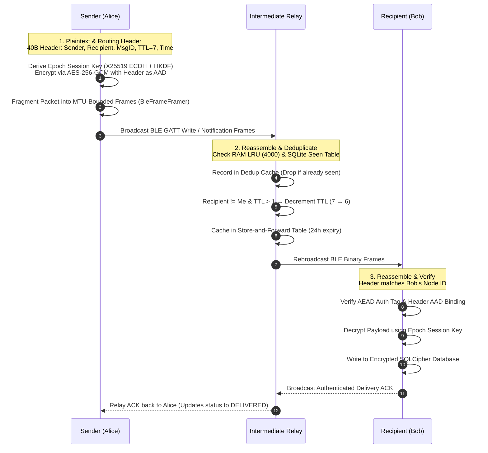

# MeshWhisper

Offline peer-to-peer messaging over a Bluetooth Low Energy (BLE) multi-hop flood-relay mesh network.

[](LICENSE)
[-brightgreen.svg)](https://developer.android.com)
[-orange.svg)](https://developer.android.com)
[](https://kotlinlang.org)

---

## 1. Problem Statement

Centralized communication infrastructure depends on cellular base stations, DNS root servers, centralized switches, and internet service provider backbones. In disaster response zones, remote search-and-rescue operations, dense protests or stadiums, and network-denied environments, centralized infrastructure fails via physical destruction, severe RF congestion, or intentional shutdowns.

MeshWhisper provides local, infrastructure-free text and media communications directly between Android devices over Bluetooth Low Energy (BLE). It requires no internet connectivity, SIM cards, Wi-Fi access points, base stations, or central servers. Every participating device acts as both an endpoint and an autonomous relay node.

---

## 2. Architecture Overview

### Core Components

```
app/src/main/java/com/meshwhisper/app/
├── ble/
│   ├── MeshBleEngine.kt        # Dual Central + Peripheral GATT manager (MTU negotiation up to 512B)
│   └── BleFrameFramer.kt       # Dynamic packet fragmentation and multi-session reassembly
├── protocol/
│   └── MeshPacket.kt           # 40-byte binary header serializer, deserializer, and AAD builder
├── router/
│   └── MeshRouter.kt           # TTL flood relay, 2-layer deduplication, store-and-forward, gossip
├── crypto/
│   └── CryptoEngine.kt         # X25519 keypairs, HKDF-SHA256 epoch derivation, AES-256-GCM AEAD
├── media/
│   └── MediaTransferManager.kt # Chunked image (≤60KB) and voice (AAC, ≤30s) transfer with flow control
├── data/
│   └── MeshDatabase.kt         # SQLCipher-encrypted Room database sealed with Android Keystore
└── ui/
    ├── graph/GraphPhysics.kt   # Force-directed Coulomb/Hooke topology simulation
    └── screens/                # Jetpack Compose UI (Public, Direct, Radar, Logs, Settings)
```

### Send → Relay → Receive Flow



---

## 3. Security Model

### Cryptographic Primitives

| Layer | Primitive | Implementation / Parameters |
| :--- | :--- | :--- |
| **Key Agreement** | X25519 ECDH | BouncyCastle `X25519KeyPairGenerator`, `X25519Agreement` |
| **Key Derivation** | HKDF-SHA256 | BouncyCastle `HKDFBytesGenerator` (RFC 5869) |
| **Authenticated Encryption** | AES-256-GCM | Standard JCA `AES/GCM/NoPadding` with 128-bit authentication tag |
| **Nonce Generation** | Unique 12-byte IV | Deterministic derivation from per-packet `UUID.randomUUID()` |
| **Database Encryption** | SQLCipher v4 | 256-bit AES database encryption (`net.zetetic:sqlcipher-android:4.6.0`) |
| **Master Key Storage** | Android Keystore | 256-bit AES-GCM master wrapping key in hardware TEE / StrongBox |

### Header Authentication via AAD

The 40-byte routing header (`type`, `messageId`, `senderId`, `recipientId`, `ttl`, `timestamp`, `payloadLength`) is supplied directly as Additional Authenticated Data (AAD) into the AES-256-GCM cipher during encryption. 

Intermediate relay nodes must inspect the header to decrement the TTL and route the frame. However, if a malicious relay alters any routing field (e.g., modifying `senderId`, `recipientId`, or `timestamp`), the recipient's AEAD tag verification fails, and the packet is discarded immediately.

### Epoch-Based Session Key Rotation

Direct message session keys are derived using X25519 ECDH shared secrets passed through HKDF-SHA256 with an epoch-bound info string:

$$\text{Epoch} = \left\lfloor \frac{\text{UNIX Timestamp}}{3600} \right\rfloor$$

$$\text{SessionKey} = \text{HKDF-Extract-and-Expand}\left(\text{salt} = \emptyset, \text{IKM} = \text{ECDH}(sk_A, pk_B), \text{info} = \text{"MESHWHISPER\_SESSION\_KEY\_V1\_EPOCH\_"} \parallel \text{Epoch}, \text{len} = 32\right)$$

Session keys automatically rotate every hour without requiring interactive key exchange handshakes over the air.

### Trust-On-First-Use (TOFU) Verification

Node public keys are bound to 64-bit Node IDs using `CryptoEngine.deriveNodeId()` (first 8 bytes of `SHA-256(publicKey)`). Public fingerprints are computed as a truncated visual hex string `XX:XX:XX:XX`.

When a `PEER_ANNOUNCE` packet arrives:
1. If the Node ID is unknown, the public key is saved to `MeshDatabase` (Trust-On-First-Use).
2. If the Node ID was previously recorded with a *different* public key, `MeshRouter` flags the peer as `hasKeyChanged = true`, purges cached session keys, and displays a prominent verification alert banner in the chat UI to detect Man-In-The-Middle (MITM) impersonation.

### At-Rest Database Protection & Panic Wipe

All persistent entities (`peers`, `messages`, `store_forward`, `packet_logs`, `processed_packets`, `topology_edges`) are stored inside a SQLCipher database. The database passphrase is encrypted with an AES-256-GCM master key stored in the hardware-backed `AndroidKeyStore`.

**Emergency Panic Wipe Routine**:
1. Purges master keys from the `AndroidKeyStore`.
2. Executes `PRAGMA secure_delete = ON;` and `VACUUM;` over the SQLCipher database.
3. Deletes all local voice notes and compressed images from the internal app storage.
4. Generates a completely new X25519 identity keypair and Node ID.

---

### Limitations & Threat Model

*Tradeoffs and operational boundaries are documented below without omission:*

1. **Deterministic Rotation vs. True Forward Secrecy**: Hourly session key derivation is deterministic from static X25519 identity keys. If an attacker extracts a device's long-term private key from memory, all historical epoch keys can be derived retroactively. True forward secrecy via ephemeral Double Ratchet state is an open roadmap item.
2. **Unauthenticated Peer Announcements**: `PEER_ANNOUNCE` and neighbor gossip packets are unauthenticated broadcast frames. Adversaries can inject arbitrary Node IDs into the radar topology visualization. End-to-end message integrity, however, remains enforced by AEAD session keys.
3. **Flood Relay Scalability**: The network utilizes uncontrolled flood routing. Channel consumption scales as $\mathcal{O}(N)$ transmissions per message. Networks with dozens of concurrent active nodes in dense RF proximity will encounter packet collisions and elevated latency.
4. **Live-Only Media Transfers**: Image and voice transmissions are **excluded from the store-and-forward queue** to protect relay storage. Media packets are forwarded live (`MEDIA_TTL = 4`); if the recipient is not currently online, the media payload is dropped.
5. **Volatile In-Memory Chunk Reassembly**: Inbound media chunks are assembled in volatile memory before atomic commitment to disk. Terminating the application process mid-transfer discards in-flight chunks.
6. **Physical Layer Attenuation**: 2.4 GHz Bluetooth signals cannot reliably penetrate reinforced concrete slabs. Multi-floor venue deployments require dedicated stairwell bridge nodes to maintain connectivity across vertical floors.

---

## 4. Protocol Internals

### Binary Packet Format

Packets are serialized as big-endian byte sequences with an exact 56-byte fixed overhead:

```
+-------------------+--------------------+--------------------+--------------------+
| PacketType (1B)   | MessageID (16B)    | SenderID (8B)      | RecipientID (8B)   |
| Offset: 0         | Offset: 1..16      | Offset: 17..24     | Offset: 25..32     |
+-------------------+--------------------+--------------------+--------------------+
| TTL (1B)          | Timestamp (4B)     | PayloadLength (2B) | Payload (N Bytes)  |
| Offset: 33        | Offset: 34..37     | Offset: 38..39     | Offset: 40..40+N-1 |
+-------------------+--------------------+--------------------+--------------------+
| AuthTag (16B)                                                                    |
| Offset: 40+N..55+N                                                               |
+----------------------------------------------------------------------------------+
```

| Field | Size | Type | Description |
| :--- | :--- | :--- | :--- |
| `type` | 1 byte | `enum` | Packet code (`0x00`: BROADCAST, `0x01`: DIRECT, `0x02`: KEY_EXCHANGE, `0x03`: ACK, `0x04`: ANNOUNCE, `0x05`: MEDIA_INIT, `0x06`: MEDIA_CHUNK) |
| `messageId` | 16 bytes | `UUID` | 128-bit unique identifier used for deduplication and IV derivation |
| `senderId` | 8 bytes | `Long` | 64-bit derived Node ID of the originating sender |
| `recipientId` | 8 bytes | `Long` | 64-bit destination Node ID, or `-1` (`0xFFFFFFFFFFFFFFFF`) for public broadcast |
| `ttl` | 1 byte | `UInt8` | Hop limit (`DEFAULT_TTL = 7`, `MEDIA_TTL = 4`); decremented at each relay hop |
| `timestamp` | 4 bytes | `UInt32` | 32-bit UNIX epoch seconds; validated against a $\pm 10$ minute drift window |
| `payloadLength`| 2 bytes | `UInt16` | Length $N$ of the ciphertext/payload (max 2048 bytes) |
| `payload` | $N$ bytes | `ByteArray` | Ciphertext or raw discovery payload |
| `authTag` | 16 bytes | `ByteArray` | 128-bit AES-256-GCM authentication tag computed over header (AAD) + payload |

### Deduplication and Store-and-Forward

1. **Two-Layer Deduplication**:
   - *Layer 1*: 4,000-entry in-memory `LruCache` keyed by `"${messageId}:${packetType}"`.
   - *Layer 2*: Persistent `processed_packets` table purged after 24 hours.
   - Prevents broadcast amplification loops across dense mesh topologies.
2. **Store-and-Forward Queue**:
   - Intermediate relays store transit DMs in `store_forward` table for 24 hours.
   - When the destination node announces presence via `PEER_ANNOUNCE`, stored frames are rebroadcast automatically.
   - Verified delivery ACKs purge queued messages across all intermediate nodes.

---

## 5. Getting Started

### Prerequisites
- Android Studio Ladybug / Meerkat or Command Line Tools
- JDK 17+
- Android SDK 35 (Minimum SDK: 26 — Android 8.0 Oreo)
- Physical Android hardware with Bluetooth Low Energy peripheral support

### Build Instructions

```powershell
# 1. Execute Unit Test Suite (Crypto, Framing, Dedup Routing, Media Transfer, Physics)
.\gradlew.bat testDebugUnitTest

# 2. Build Debug Sideload APK
.\gradlew.bat assembleDebug

# 3. Build Minified Production APK (R8 / ProGuard optimized)
.\gradlew.bat assembleRelease
```

Build outputs:
- Debug APK: `app/build/outputs/apk/debug/app-debug.apk`
- Release APK: `app/build/outputs/apk/release/app-release-unsigned.apk`

### Sideload Installation

```powershell
adb install -r app/build/outputs/apk/debug/app-debug.apk
```

---

## 6. Multi-Floor / Large-Venue Deployment Guide

Because 2.4 GHz RF signals suffer 20–30 dB attenuation when traversing reinforced concrete floor slabs, vertical propagation requires dedicated bridge nodes placed along open stairwell shafts.

```
[Floor 4: Room 402] ──────BLE──────▶ [Stairwell Bridge Node #4]
                                                │ (Vertical Airshaft)
                                                ▼
[Floor 3: Lab 301]  ◀─────BLE─────── [Stairwell Bridge Node #3]
                                                │
                                                ▼
[Floor 2: Aud-2]    ◀─────BLE─────── [Stairwell Bridge Node #2]
                                                │
                                                ▼
[Floor 1: Lobby]    ◀─────BLE─────── [Stairwell Bridge Node #1]
```

### Operational Guidelines

- **Stairwell Placement**: Position bridge phones at stair landing platforms. Open stairwells form a continuous RF waveguide across building levels.
- **Battery Optimization**: Set app battery usage to **Unrestricted** on dedicated bridge devices (`Settings -> Apps -> MeshWhisper -> Battery -> Unrestricted`) to prevent OEM power managers from killing background BLE services.
- **Hop Budgeting**: With `DEFAULT_TTL = 7`, a packet traverses up to 6 intermediate relays. Aligning bridge nodes along vertical stairwell axes preserves TTL for horizontal distribution on target floors.

---

## 7. Roadmap

- [ ] **Signal Double Ratchet Integration**: Replace deterministic epoch derivation with ephemeral Diffie-Hellman ratcheting for true per-message forward secrecy and break-in recovery.
- [ ] **Keystore Fallback Removal**: Enforce strict hardware StrongBox/TEE key generation and reject devices lacking secure hardware key storage.
- [ ] **Epidemic Routing Optimization**: Implement Bloom-filter history summaries during peer discovery to replace flood broadcasting with scoped delta synchronization.

---

## 8. License

MeshWhisper is licensed under the [Apache License, Version 2.0](LICENSE).
