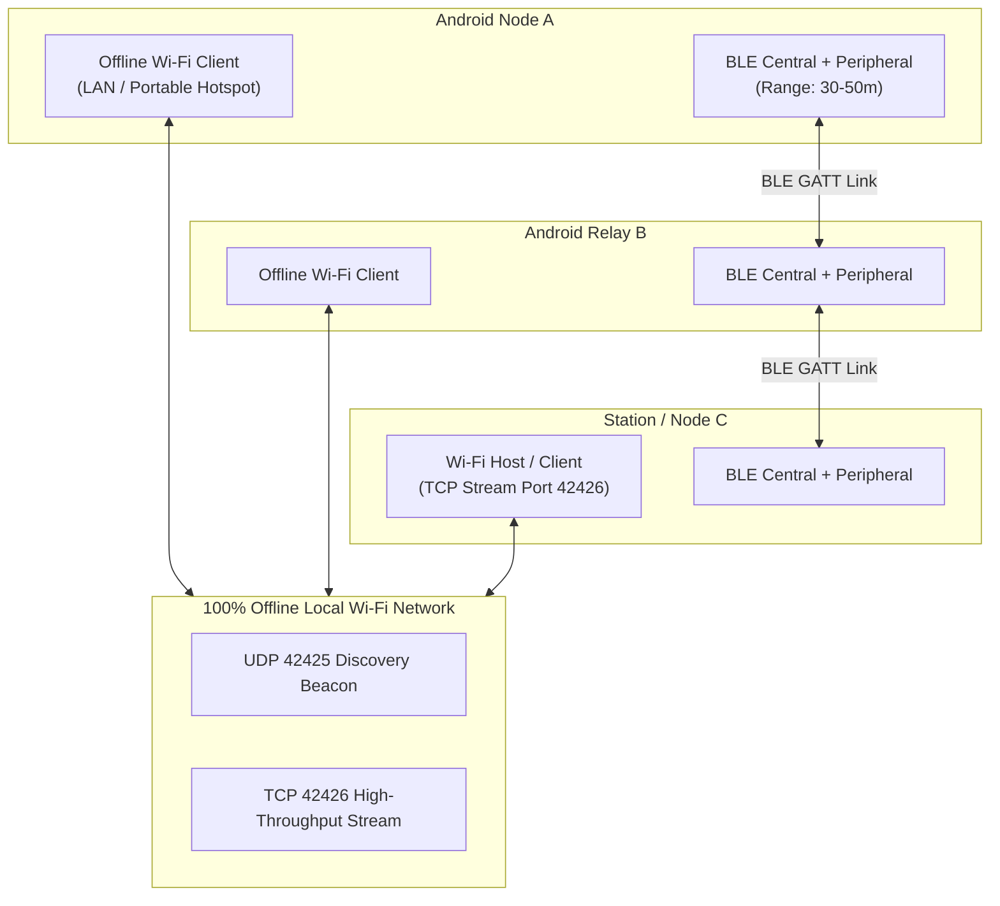

# MeshWhisper / BIT FOR US

**Offline, infrastructure-free peer-to-peer communications, tactical coordination, and emergency distress mesh networking over a hybrid Bluetooth Low Energy (BLE) + Offline Local Wi-Fi transport.**

[](LICENSE)
[-brightgreen.svg)](https://developer.android.com)
[-orange.svg)](https://developer.android.com)
[](https://kotlinlang.org)
[](https://developer.android.com/training/camerax)
[-success.svg)](docs/TESTING.md)
[](docs/ARCHITECTURE.md)
[](docs/SECURITY.md)

---

## 1. Problem Statement & System Overview

Centralized telecommunication networks depend critically on cellular base stations, centralized IP switches, internet service provider backbones, and public DNS roots. In disaster scenarios, search-and-rescue operations, remote wilderness expeditions, and network-denied environments, centralized infrastructure is vulnerable to physical destruction, power grid loss, RF congestion, or intentional shutdowns.

**BIT FOR US (MeshWhisper)** provides resilient, 100% offline text, location, distress signaling, media synchronization, and real-time voice communications directly between devices without requiring cellular towers, SIM cards, internet access, or central servers. 

Every participating device acts as an autonomous relay node, forming a self-healing, multi-hop mesh network over a **Dual-Radio Hybrid Transport (Bluetooth Low Energy + Local Wi-Fi Sockets)**.



---

## 2. Comprehensive Documentation Suite

Exhaustive, low-level technical specifications, threat models, protocol framing, and operational limits are documented in the **`docs/`** directory:

| Specification | Focus & Key Contents |
| :--- | :--- |
| **[docs/ARCHITECTURE.md](docs/ARCHITECTURE.md)** | Subsystem overview, module boundaries, packet ingestion pipeline, Dijkstra dynamic routing engine, relay custody model, 4-tier QoS traffic scheduler, and Room v11 database schema. |
| **[docs/PROTOCOL.md](docs/PROTOCOL.md)** | 56-byte binary wire framing, all 17 packet types (`0x00`–`0x10`), default TTLs, binary payload structures for voice/profiles/media, and AAD calculation. |
| **[docs/SECURITY.md](docs/SECURITY.md)** | Cryptographic primitives (X25519 ECDH, Ed25519 signatures, HKDF-SHA256, AES-256-GCM AEAD, PBKDF2), hardware TEE key wrapping, Safety Numbers, anti-rollback, and threat model matrix. |
| **[docs/LIMITATIONS.md](docs/LIMITATIONS.md)** | Physical radio constraints, strict 1-hop voice boundary, BLE connection caps (max 5), Android Doze mode background restrictions, store-and-forward quotas, and RF validation status. |
| **[docs/TESTING.md](docs/TESTING.md)** | Complete breakdown of all 118 automated tests across `:core` (38), `:app` (77), and `:desktop` (3), execution commands, and real-device RF testing guidelines. |
| **[docs/ROADMAP.md](docs/ROADMAP.md)** | Chronology of completed Milestones 1–4, near-term priorities (dense multi-phone RF trials, BLE connection tuning), and long-term research (LoRa hardware bridges, DTN bundles). |
| **[CONTRIBUTING.md](CONTRIBUTING.md)** | Developer environment setup, coding conventions, architectural invariants, testing rules, and PR checklist. |
| **[CHANGELOG.md](CHANGELOG.md)** | Chronological history of milestones, architectural enhancements, and protocol modifications. |

---

## 3. Core Architectural Capabilities

### 3.1. Dynamic Shortest-Path Next-Hop Routing
- **`MeshRouteEngine`**: Pure Kotlin Dijkstra shortest-path engine calculating optimal next-hop routes based on physical neighbor links and gossiped topology edges.
- **Transport Weighting**: High-throughput Wi-Fi links are preferred (weight = 1) over constrained BLE links (weight = 5).
- **Directed Relay**: Replaces blind epidemic flooding with directed next-hop unicast forwarding, falling back to controlled flood only if the destination route is unknown.
- **Relay Custody & Automatic Cleanup**: Intermediate relay nodes buffer packets in `store_forward_queue` and delete them once downstream next-hop transmission or destination ACK is observed.
- **Link Failure Quarantine & Rerouting**: 3 consecutive transmission timeouts apply a 60-second penalty quarantine to the failing link, forcing automatic recalculation of alternative routes.
- **Lost-ACK Recovery**: Re-emits delivery confirmations when a sender retransmits a direct message whose ACK was dropped in transit.

### 3.2. 4-Tier Quality-of-Service (QoS) Traffic Scheduling
- **`MeshTrafficController`**: Outbound traffic is scheduled across four bounded priority FIFO queues (100 packets max per queue) with anti-starvation protection:
  - **Tier 0 (`CRITICAL_EMERGENCY`)**: Emergency SOS distress beacons (immediate zero-delay dispatch).
  - **Tier 1 (`HIGH_INTERACTIVE`)**: Delivery ACKs, key exchange, typing indicators, voice call signaling, voice frames.
  - **Tier 2 (`STANDARD_MESSAGING`)**: Point-to-point encrypted direct messages, public channel chat, profile updates.
  - **Tier 3 (`BULK_TRANSFER`)**: Media chunks, avatar fragments, historical store-and-forward synchronization.

### 3.3. Real-Time 1-Hop Duplex Voice Calling
- **Strict 1-Hop Constraint**: Voice calling is strictly point-to-point between direct radio neighbors ($ttl = 1$). Voice packets are volatile real-time streams and **never** enter multi-hop relay queues or the Room database.
- **`VoiceCallManager`**: State machine managing call lifecycles (`IDLE`, `OUTGOING_RINGING`, `INCOMING_RINGING`, `CONNECTED`, `ENDED`) with 30-second ringing timeouts and 10-second heartbeat watchdogs.
- **`AdpcmCodec`**: 4-bit IMA ADPCM audio compression encoding 16-bit 8 kHz mono linear PCM (20ms frames / 160 samples per frame) into 80-byte audio payloads (1:4 compression ratio, 32 kbps). Total packet size with headers is 164 bytes, fitting inside standard BLE ATT MTUs without link-layer fragmentation.
- **`JitterBuffer`**: Adaptive playout buffer with a dynamic 60ms target latency, sequence reordering, packet loss concealment (PLC), and late-arrival discard.
- **Android Audio Pipeline**: Hardware integration via `AudioRecord` (`VOICE_COMMUNICATION` with acoustic echo cancellation) and `AudioTrack` (`STREAM_VOICE_CALL`).

### 3.4. Cryptographically Signed Profiles & Anti-Rollback
- **`ProfilePayload`**: Canonical binary framing for user profile distribution (display name, bio, avatar hash, version counter).
- **Ed25519 Signatures**: Every profile update is cryptographically signed with the user's private identity key; peers reject unsigned or invalid profiles.
- **Anti-Rollback Version Protection**: Monotonically increasing 64-bit epoch timestamp counter; older or duplicate updates are rejected to defeat replay attacks.
- **Chunked Avatar Sync**: Reliable, bounded chunk transfer for user profile avatars (max 32 KB).

### 3.5. End-to-End Cryptographic Security & Hardware TEE
- **End-to-End Encryption**: Ephemeral X25519 ECDH key exchange deriving per-session AES-256-GCM AEAD keys via HKDF-SHA256, binding the 56-byte wire header as Associated Authenticated Data (AAD).
- **Public Channel Isolation**: Public channels derive distinct 256-bit AES-GCM keys using PBKDF2-HMAC-SHA256 (100,000 rounds) over channel names.
- **Hardware TEE Key Protection**: Master database encryption passphrase is generated and stored securely within the AndroidKeyStore Trusted Execution Environment (TEE).
- **Out-of-Band Safety Numbers**: Visual fingerprint comparison and live CameraX QR code scanning to verify identity keys and defeat active Man-in-the-Middle (MitM) attacks.
- **Instant Panic Wipe**: Synchronous wiping of all cryptographic keys, SQLCipher databases, shared preferences, and cached media followed by immediate process termination.

---

## 4. Implementation Status Matrix

In accordance with our core engineering principle (**"Code is the Source of Truth"**), the operational state of every subsystem is explicitly classified below:

| Feature / Subsystem | Implementation Status | Implementation Notes |
| :--- | :---: | :--- |
| **56-byte Binary Wire Protocol** | `SHIPPED` | Fully implemented in `:core` (`MeshPacket.kt`); validates CRC-32 and AAD. |
| **Pure JVM Cryptographic Engine** | `SHIPPED` | Pure Kotlin BouncyCastle (`PureCryptoEngine.kt`); 100% offline. |
| **SQLCipher Encrypted Database** | `SHIPPED` | Room Schema **Version 11** with AndroidKeyStore TEE passphrase wrapping. |
| **4-Tier QoS Traffic Scheduling** | `SHIPPED` | `MeshTrafficController.kt` with anti-starvation deficit scheduler. |
| **Dijkstra Dynamic Routing Engine** | `SHIPPED` | `MeshRouteEngine.kt` with link failure quarantine and directed next-hop relay. |
| **Relay Custody & ACK Recovery** | `SHIPPED` | Custody buffering until next-hop handoff; duplicate ACK re-emission. |
| **Signed Profiles & Anti-Rollback** | `SHIPPED` | Canonical `ProfilePayload.kt` with Ed25519 signature and 64-bit versioning. |
| **Direct 1-Hop Voice Calling** | `SHIPPED` | `VoiceCallManager`, `AdpcmCodec` (4-bit 8 kHz), `JitterBuffer` ($ttl = 1$). |
| **BLE GATT Dual-Role Transport** | `IMPLEMENTED` | Simultaneous Central + Peripheral with MAC address symmetry tie-breaking. |
| **Local Offline Wi-Fi Transport** | `IMPLEMENTED` | UDP discovery (42425) and TCP socket streaming (42426). |
| **CameraX Safety Number QR Scanner** | `IMPLEMENTED` | Row-stride safe luminance analyzer with tactical viewfinder UI. |
| **GPS Radar Compass** | `IMPLEMENTED` | Standalone `LocationManager` satellite acquisition without Google Play Services. |
| **Multi-Hop Voice Mesh Relaying** | `NON-GOAL` | **Explicitly NOT supported**. Real-time voice is strictly direct 1-hop only. |
| **Physical Multi-Device RF Validation** | `UNVALIDATED` | 118 unit tests pass on JVM; physical multi-phone field trials pending. |

---

## 5. Repository Structure

```
MeshWhisper/
├── docs/                               # Comprehensive Technical Specifications
│   ├── ARCHITECTURE.md                 # System architecture, routing, QoS, schema
│   ├── PROTOCOL.md                     # 56-byte wire framing, packet types, payloads
│   ├── SECURITY.md                     # Crypto engine, TEE keys, threat model
│   ├── LIMITATIONS.md                  # Physical boundaries, radio caps, scope limits
│   ├── TESTING.md                      # Test architecture, 118 tests, verification matrix
│   └── ROADMAP.md                      # Implemented milestones and future research
│
├── core/                               # Pure Kotlin JVM Shared Module (Zero Android SDK Dependencies)
│   ├── src/main/java/com/meshwhisper/core/
│   │   ├── protocol/
│   │   │   ├── MeshPacket.kt           # 56-byte wire framing, serialization & AAD calculation
│   │   │   ├── PacketType.kt           # 17 packet type definitions (0x00 to 0x10)
│   │   │   ├── TrafficPriority.kt      # 4-tier QoS priority classifications
│   │   │   ├── MeshTrafficController.kt# Non-blocking 4-tier egress queue scheduler
│   │   │   └── ProfilePayload.kt       # Canonical binary user profile framing
│   │   ├── audio/
│   │   │   ├── AdpcmCodec.kt           # 8 kHz 4-bit IMA ADPCM encoder & decoder
│   │   │   └── JitterBuffer.kt         # Adaptive playout buffer with loss concealment
│   │   ├── crypto/
│   │   │   ├── PureCryptoEngine.kt     # BouncyCastle X25519, Ed25519, HKDF, AES-GCM, PBKDF2
│   │   │   └── SecureKeyStorage.kt     # Abstract key persistence interface
│   │   ├── router/
│   │   │   ├── MeshRouteEngine.kt      # Dijkstra shortest-path engine with link quarantine
│   │   │   └── LruDedupCache.kt        # Thread-safe LinkedHashMap LRU deduplication cache
│   │   └── logging/MeshLogger.kt       # Platform-neutral logging abstraction
│   └── src/test/java/com/meshwhisper/core/
│       ├── AdpcmCodecTest.kt           # Audio encoding/decoding roundtrip fidelity tests
│       ├── JitterBufferTest.kt         # Reordering, late-arrival discard & PLC tests
│       ├── MeshRouteEngineTest.kt      # Dijkstra routing, link failure & failover tests
│       ├── PureCryptoEngineTest.kt     # Key agreement, signature & cipher verification
│       └── MultiHopRelayAndSecurityMeshTest.kt # Multi-hop routing & isolation tests
│
├── app/                                # Android Application Module (Dual-Radio Engine + UI)
│   ├── src/main/java/com/meshwhisper/app/
│   │   ├── ble/
│   │   │   ├── MeshBleEngine.kt        # Dual Central/Peripheral GATT manager & symmetry resolution
│   │   │   ├── BleFrameFramer.kt       # Dynamic MTU packet fragmentation & reassembly
│   │   │   └── GattWriteRateLimiter.kt # Ingress rate limiter (50 writes/sec)
│   │   ├── wifi/MeshWifiEngine.kt      # Offline Wi-Fi UDP discovery (42425) & TCP streaming (42426)
│   │   ├── router/MeshRouter.kt        # Dual-radio multiplexer, CSMA jitter & packet dispatcher
│   │   ├── voice/
│   │   │   ├── VoiceCallManager.kt     # Call state machine, signaling, timeouts & watchdog
│   │   │   ├── AndroidAudioStreamer.kt # AudioRecord mic capture & AudioTrack low-latency playback
│   │   │   └── VoiceCallSession.kt     # Call session data model
│   │   ├── media/MediaTransferManager.kt# Bounded chunked media transfer with NACK retransmission
│   │   ├── crypto/CryptoEngine.kt      # AndroidKeyStore hardware TEE key wrapping & preferences
│   │   ├── data/MeshDatabase.kt        # SQLCipher-encrypted Room database (Schema Version 11)
│   │   ├── location/LocationHelper.kt  # Zero-dependency hardware GPS satellite acquisition
│   │   ├── service/MeshForegroundService.kt # Background radio watchdog & adaptive duty-cycle
│   │   └── ui/
│   │       ├── screens/                # DirectChat, PublicMesh, Identity, Radar, QRScanner
│   │       ├── components/             # CameraQrScanner, CallOverlayDialog, Sahara theme
│   │       └── viewmodel/MeshViewModel.kt # Central StateFlow UI coordinator
│   └── src/test/java/com/meshwhisper/app/
│       ├── VoiceCallManagerTest.kt     # Call state transitions, ring timeouts & signaling
│       ├── MeshRouterTest.kt           # Packet ingestion, L1/L2 dedup & voice fast-path
│       ├── MediaTransferManagerTest.kt # Chunked transfer & session bounds
│       └── TrafficSchedulerTest.kt     # Priority scheduling & anti-starvation validation
│
└── desktop/                            # Companion Workstation Module (JVM CLI / Station Node)
    └── src/main/java/com/meshwhisper/desktop/
        ├── crypto/DesktopPassphraseKeyStorage.kt # PBKDF2-protected identity storage
        ├── db/DesktopDatabase.kt       # Embedded SQLite (sqlite-jdbc) with topology edges
        ├── wifi/DesktopWifiEngine.kt   # Pure java.net UDP discovery & TCP socket manager
        ├── router/DesktopMeshRouter.kt # Desktop packet dispatcher & flood router
        └── Main.kt                     # Interactive CLI console & desktop mesh monitor
```

---

## 6. Quickstart & Developer Guide

### Prerequisites
- **Java Development Kit**: JDK 17 (Microsoft OpenJDK 17 or Eclipse Temurin 17).
- **Android SDK**: `compileSdk = 35`, `minSdk = 26`, `targetSdk = 35`.
- **Build Tool**: Gradle Wrapper included (Gradle 8.11.1).

### Building the Project

```bash
# Clone the repository
git clone https://github.com/gintama1018/BIT-FOR-US.git
cd BIT-FOR-US

# Build debug APK (Windows)
.\gradlew.bat assembleDebug

# Build debug APK (Linux / macOS)
./gradlew assembleDebug
```

The output APK will be generated at:
`app/build/outputs/apk/debug/app-debug.apk`

### Running the Automated Test Suite

MeshWhisper maintains **118 automated tests passing 100% offline**:

```bash
# Run all unit tests across :core, :app, and :desktop
# Windows:
.\gradlew.bat test

# Linux / macOS:
./gradlew test
```

Module-specific test execution:
```bash
# Core pure JVM tests (38 tests)
.\gradlew.bat :core:test

# Android app local JVM tests (77 tests)
.\gradlew.bat :app:testDebugUnitTest

# Desktop workstation tests (3 tests)
.\gradlew.bat :desktop:test
```

### Running the Desktop Station Node

The desktop module provides a standalone JVM mesh station that connects to local offline Wi-Fi networks:

```bash
# Windows
.\gradlew.bat :desktop:run --console=plain

# Linux / macOS
./gradlew :desktop:run --console=plain
```

---

## 7. Operational Boundaries & Physical Limitations

For full details, see [docs/LIMITATIONS.md](docs/LIMITATIONS.md). A summary of critical boundaries:

1. **Voice is Strictly Direct 1-Hop**: Voice packets (`VOICE_CALL_SIGNAL`, `VOICE_FRAME`) are enforced with $ttl = 1$. Multi-hop voice mesh relaying is **not supported** due to BLE throughput constraints (30–80 kbps) and compounding packet loss across intermediate hops.
2. **Audio Quality**: Audio is encoded using 4-bit IMA ADPCM at 8 kHz mono. This provides clean tactical speech intelligibility comparable to standard landline telephony, but is not designed for wideband high-fidelity audio or music.
3. **BLE Connection Limit**: Android hardware typically limits concurrent BLE GATT connections to 4–7 peers. MeshWhisper caps concurrent BLE connections at 5 to maintain radio stability.
4. **Android Doze Mode**: In deep Doze mode, Android suspends BLE scanning and throttles CPU execution. While `MeshForegroundService` maintains background duty-cycling, packet delivery latencies increase when devices are idle and stationary.
5. **Physical Multi-Phone RF Trials Pending**: All 118 automated tests validate protocol framing, routing algorithms, audio codecs, and state machines on JVM runtimes. Dense multi-phone RF testing in noisy real-world environments is scheduled on the project roadmap.

---

## 8. License & Intellectual Property

MeshWhisper / BIT FOR US is licensed under the **Apache License, Version 2.0**. See [LICENSE](LICENSE) for full details.
