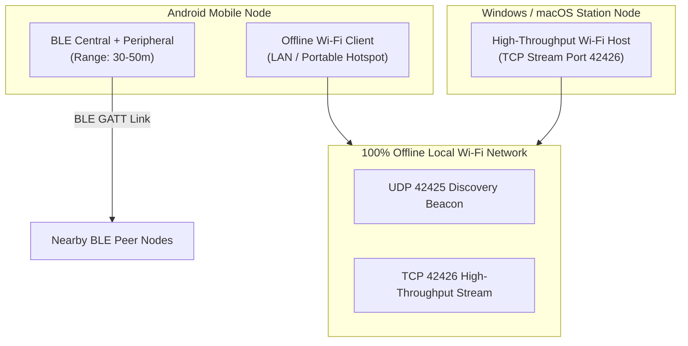
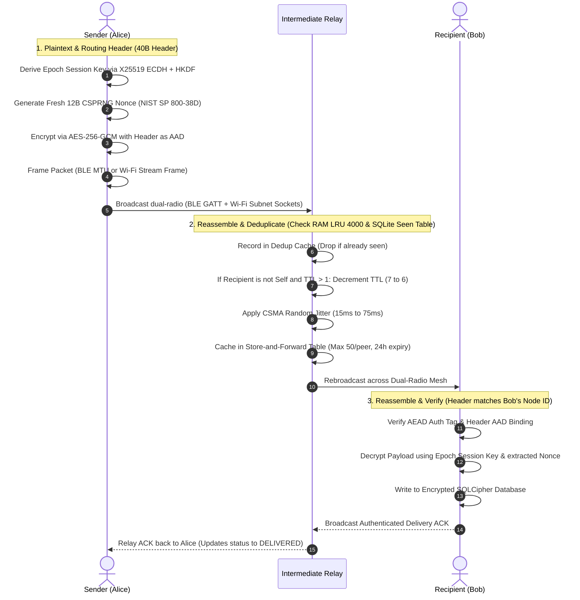

# MeshWhisper

Offline, infrastructure-free peer-to-peer messaging, tactical team coordination, and emergency search-and-rescue over a hybrid **Bluetooth Low Energy (BLE) + Offline Wi-Fi LAN / Hotspot** multi-hop flood-relay mesh network.

[](LICENSE)
[-brightgreen.svg)](https://developer.android.com)
[-orange.svg)](https://developer.android.com)
[](https://kotlinlang.org)
[](https://developer.android.com/training/camerax)
[-success.svg)](file:///c:/Users/hp/Downloads/BIT%20FOR%20US)
[-brightgreen.svg)](file:///c:/Users/hp/Downloads/BIT%20FOR%20US)

---

## 1. Problem Statement

Centralized communication infrastructure depends on cellular base stations, DNS root servers, centralized switches, and internet service provider backbones. In disaster response zones, remote search-and-rescue operations, dense protests or stadiums, and network-denied environments, centralized infrastructure fails via physical destruction, severe RF congestion, or intentional shutdowns.

MeshWhisper provides local, 100% offline text, location, voice, and media communications directly between devices over a **Dual-Radio Hybrid Transport (BLE + Local Wi-Fi Sockets)**. It requires zero internet connectivity, SIM cards, cellular towers, or central servers. Every participating device acts as both an endpoint and an autonomous relay node.

---

## 2. Architecture Overview

> For the comprehensive low-level specification, binary packet framing diagrams, and threat model analysis, see [ARCHITECTURE.md](ARCHITECTURE.md).

### Modular Architecture Layout

```
MeshWhisper/
├── core/                               # Pure Kotlin JVM Shared Module (Zero Android SDK dependencies)
│   ├── src/main/java/com/meshwhisper/core/
│   │   ├── protocol/MeshPacket.kt      # 56-byte binary wire protocol, serializer & AAD builder
│   │   ├── crypto/PureCryptoEngine.kt  # BouncyCastle X25519 ECDH, Ed25519 Signatures, HKDF-SHA256,
│   │   │                               # PBKDF2-HMAC-SHA256 (100k rounds) & NIST SP 800-38D AES-GCM
│   │   ├── crypto/SecureKeyStorage.kt  # Platform-independent key storage contract
│   │   ├── router/LruDedupCache.kt     # Pure Kotlin LinkedHashMap thread-safe LRU dedup cache
│   │   └── logging/MeshLogger.kt       # Platform-neutral logging abstraction
│   └── src/test/java/com/meshwhisper/core/
│       ├── MultiHopRelayAndSecurityMeshTest.kt # Multi-hop flood relay, PBKDF2 channel isolation tests
│       └── PureCryptoEngineTest.kt     # ECDH key agreement, Ed25519 signature & cipher tests
│
├── app/                                # Android Application Module (Dual-Radio BLE + Wi-Fi)
│   ├── src/main/java/com/meshwhisper/app/
│   │   ├── ble/MeshBleEngine.kt        # Dual Central + Peripheral GATT manager with symmetry tie-breaking
│   │   ├── ble/BleFrameFramer.kt       # Dynamic packet fragmentation & reassembly
│   │   ├── wifi/MeshWifiEngine.kt      # Offline Wi-Fi LAN/Hotspot UDP discovery (42425) & TCP (42426)
│   │   ├── router/MeshRouter.kt        # Dual-radio multiplexer, CSMA jitter, store-and-forward
│   │   ├── crypto/CryptoEngine.kt      # AndroidKeyStore hardware TEE key wrapping & preferences
│   │   ├── data/MeshDatabase.kt        # SQLCipher-encrypted Room database (Migration 9 → 10)
│   │   ├── location/LocationHelper.kt  # Zero-dependency hardware GPS satellite acquisition
│   │   └── ui/
│   │       ├── components/CameraQrScanner.kt # Live CameraX preview, tactical HUD & torch controls
│   │       ├── components/QrCodeAnalyzer.kt  # Stride-safe Y-plane barcode parser with rotation handling
│   │       ├── screens/DirectChatDetailScreen.kt # Live in-app Safety Number camera verification
│   │       ├── screens/DirectChatsScreen.kt      # Fast QR pair-and-chat scanner in top app bar
│   │       ├── screens/IdentitySettingsScreen.kt # Station Vault, QR out-of-band key verification
│   │       ├── screens/PublicMeshScreen.kt       # Dynamic PBKDF2 channel switcher & QR channel share
│   │       └── screens/MeshRadarScreen.kt        # Offline GPS radar compass & peer homing vector
│   └── src/androidTest/java/com/meshwhisper/app/
│       └── AndroidSecurityAndStorageTest.kt  # Real on-device Android runtime Keystore & SQLCipher tests
│
└── desktop/                            # Windows / macOS Companion Mesh Station
    └── src/main/java/com/meshwhisper/desktop/
        ├── crypto/DesktopPassphraseKeyStorage.kt # PBKDF2-HMAC-SHA256 encrypted identity vault
        ├── db/DesktopDatabase.kt       # Embedded SQLite (sqlite-jdbc) with 6 core tables & topology_edges
        ├── wifi/DesktopWifiEngine.kt   # Pure java.net UDP discovery & high-throughput TCP streaming
        ├── router/DesktopMeshRouter.kt # Desktop flood router, dedup & topology edge tracker
        └── Main.kt                     # Interactive Desktop Mesh Station & Management Console
```

### Dual-Radio Cross-Platform Mesh Architecture



### Send → Relay → Receive Sequence Flow



---

## 3. Emergency Search-and-Rescue (SAR) & Location

MeshWhisper includes an autonomous **Emergency Response & Search-and-Rescue Suite**:

1. **Hardware Satellite GPS (`LocationHelper.kt`)**:
   - Directly queries onboard satellite GPS via `LocationManager` (`GPS_PROVIDER`, `NETWORK_PROVIDER`).
   - Zero Google Play Services / internet dependencies — 100% offline.
   - Includes timestamp staleness validation to prevent propagating outdated location fixes.
2. **Priority SOS Broadcast (`sendSosBroadcast`)**:
   - Length-prefixed deterministic binary framing: `[flags: 1B][textLen: 2B][text: NB][lat: 8B][lon: 8B][accuracy: 4B][timestamp: 8B]`.
   - Digitally signed with the sender's Ed25519 identity key to prevent emergency beacon spoofing.
   - Priority flood routing with reduced collision jitter (5ms - 20ms) for instantaneous propagation.
3. **Emergency Keyword Triage**:
   - Heuristic regex analysis scans outgoing broadcasts for distress triggers (`help`, `trapped`, `emergency`, `medical`, `bleeding`, `bachao`, `madad`, `earthquake`) and automatically prompts fast-action SOS elevation.
4. **Directional Homing Compass & Map Radar**:
   - Live trigonometry computation calculates true bearing and distance (meters/km) to peer last-known GPS coordinates.
   - Sensor fusion compass arrow points responders directly toward trapped individuals in off-grid disaster zones.

---

## 4. Cryptographic & Security Architecture

### Cryptographic Primitives Specification

| Layer | Primitive | Implementation / Parameters | Standard / RFC |
| :--- | :--- | :--- | :--- |
| **Key Agreement** | X25519 ECDH | BouncyCastle `X25519KeyPairGenerator`, `X25519Agreement` | RFC 7748 |
| **Identity Signatures** | Ed25519 | BouncyCastle `Ed25519Signer`, `Ed25519PrivateKeyParameters` | RFC 8032 |
| **Key Derivation (DM)** | HKDF-SHA256 | BouncyCastle `HKDFBytesGenerator` | RFC 5869 |
| **Channel Key Derivation** | PBKDF2-HMAC-SHA256 | Java Cryptography Architecture (100,000 iterations + salt) | RFC 8018 / NIST SP 800-132 |
| **Authenticated Encryption** | AES-256-GCM | Standard JCA `AES/GCM/NoPadding` with 128-bit authentication tag | NIST SP 800-38D |
| **Nonce Generation** | Fresh 96-bit CSPRNG | `SecureRandom().nextBytes(12)` prepended to ciphertext | NIST SP 800-38D RBG |
| **Database Encryption** | SQLCipher v4 | 256-bit AES-CBC with HMAC-SHA512 (`net.zetetic:sqlcipher-android:4.6.0`) | SQLCipher Architecture |
| **Master Key Vault** | Android KeyStore | 256-bit AES-GCM master key in hardware TEE / StrongBox | Android Security Architecture |

---

### In-App Camera QR Scanner & Live Safety Number Verification

To close the out-of-band trust loop and provide true defense against Man-In-The-Middle (MITM) attacks, MeshWhisper features a fully native in-app camera barcode scanner powered by **AndroidX CameraX 1.4.1** and **ZXing 3.5.3**:

1. **Native Viewfinder (`CameraQrScanner.kt`)**:
   - Live camera preview integrated into Jetpack Compose via `PreviewView`.
   - Tactical HUD overlay with glowing emerald targeting brackets and animated laser reticle sweep line.
   - Hardware flashlight/torch toggle and front/back camera switching.
2. **High-Performance Offline Analysis (`QrCodeAnalyzer.kt`)**:
   - Zero RGB overhead: extracts raw 8-bit Y-luminance planes directly from CameraX `ImageProxy` frames.
   - Handles sensor rotation (90°, 180°, 270°) and device row-stride padding across all hardware chipsets.
3. **Closed-Loop Verification Flows**:
   - **Direct Chat Detail Screen**: Inside the Safety Number dialog, users tap *"Scan Peer's Screen with Camera"*. The camera scans the peer's QR code and verifies their X25519 public key in real time. If matched, the peer is permanently stamped with a green verified shield badge (`isVerified = true`). If keys do not match, an immediate **MITM Warning Alert** is raised.
   - **Station Vault / Identity Settings**: Users can scan another device to import and verify their identity out-of-band.
   - **Direct Chats Screen**: Fast top-bar camera button allows responders to pair with peers and immediately enter an authenticated chat.

---

### Dynamic Mesh Channel Passphrase Key Derivation

MeshWhisper eliminates hardcoded broadcast secrets (`"MASTER_ROOT_KEY_MATERIAL"` is permanently removed) and establishes clean cryptographic domain separation:

1. **Public Emergency Channel (Open Broadcast)**:
   - Root: `"MESHWHISPER_PUBLIC_EMERGENCY_DISASTER_ROOT_V1"` with `PUBLIC_CHANNEL_SALT`.
   - Used for open civilian distress broadcasts, beacons, and search-and-rescue discovery.
   - Integrity and authenticity are guaranteed via **Ed25519 sender identity digital signatures** on every packet.
2. **Private Team & Tactical Channels (Confidential Comms)**:
   - Responders, medical teams, and tactical squads can configure custom channels (e.g. `TEAM_ALPHA`, `TRIAGE_NORTH`).
   - The 256-bit AES-GCM channel key is derived dynamically via PBKDF2-HMAC-SHA256 (100,000 iterations):
      ```text
      Salt = SHA256("MESHWHISPER_TACTICAL_CHANNEL_SALT_V1:" + ChannelName)[0..15]
      ChannelKey = PBKDF2-HMAC-SHA256(Passphrase, Salt, iterations = 100000, keyLength = 256)
      ```
   - Nodes on the mesh without the passphrase cannot read, decrypt, or forge team communications.
   - Active channel credentials are encrypted and stored in the device's hardware **AndroidKeyStore**.
   - Responders can share their private channel via on-screen QR codes or scan nearby teammates' codes to join the confidential channel in seconds.

---

### Dual-Role BLE Symmetry Resolution & Power Duty-Cycling

To overcome Android's physical Bluetooth Low Energy hardware connection limits (~5 active GATT links) and prevent driver lockups:

1. **Deterministic Symmetry Tie-Breaking (`MeshBleEngine.kt`)**:
   - Mutual scanning previously caused both devices to initiate outbound central connections to each other, burning 2 slots per peer and causing `GATT_CONN_L2C_FAILURE (status 133)`.
   - MeshWhisper implements deterministic lexicographical address tie-breaking: the device with the higher MAC address initiates as Central; the lower address device waits as Peripheral. Only **one physical connection** is maintained per peer pair.
2. **Background Battery Duty-Cycling**:
   - When backgrounded, the BLE scanner downshifts to `SCAN_MODE_LOW_POWER` (10% duty cycle) and the advertiser downshifts to `ADVERTISE_MODE_LOW_POWER` with `ADVERTISE_TX_POWER_LOW`, reducing idle RF drain by ~70%.

---

### Software CSMA Collision Avoidance Jitter

In epidemic flood routing, rebroadcasting packets immediately upon receipt triggers simultaneous transmissions across neighboring nodes on shared 2.4 GHz frequencies, causing packet loss and broadcast storms.

MeshWhisper implements software **Carrier-Sense Collision Avoidance (CSMA) Jitter**:
- Standard broadcast relays insert a randomized non-blocking coroutine delay between **15ms and 75ms** before retransmitting.
- High-priority emergency SOS relays use an expedited jitter window of **5ms to 20ms**, desynchronizing neighboring radios while maintaining rapid propagation.

---

### Synchronous Panic Wipe

When the user triggers Emergency Panic Wipe:
1. Replaced asynchronous `.apply()` with blocking `.commit()` in `CryptoEngine.kt`.
2. Destroys all identity keys, session keys, and channel passphrases synchronously from flash memory.
3. Closes Room database connection, deletes SQLite database files, WAL logs, and media caches.
4. Kills the process (`Process.killProcess(myPid)`) with **zero race window**.

---

## 5. Protocol Internals

### Binary Packet Format

Packets are serialized as big-endian byte sequences with an exact 56-byte fixed overhead:

```
+-------------------+--------------------+--------------------+--------------------+
| PacketType (1B)   | MessageID (16B)    | SenderID (8B)      | RecipientID (8B)   |
| Offset: 0         | Offset: 1..16      | Offset: 17..24     | Offset: 25..32     |
+-------------------+--------------------+--------------------+--------------------+
| TTL (1B)          | Timestamp (4B)     | PayloadLength (2B) | Payload (N Bytes)  |
| Offset: 33        | Offset: 34..37     | Offset: 38..39     | Offset: 40..40+N-1 |
+-------------------+--------------------+--------------------+--------------------+
| AuthTag (16B)                                                                    |
| Offset: 40+N..55+N                                                               |
+----------------------------------------------------------------------------------+
```

| Field | Size | Type | Description |
| :--- | :--- | :--- | :--- |
| `type` | 1 byte | `enum` | Packet code: `0x00`: BROADCAST, `0x01`: DIRECT, `0x02`: KEY_EXCHANGE, `0x03`: ACK, `0x04`: PEER_ANNOUNCE, `0x05`: MEDIA_INIT, `0x06`: MEDIA_CHUNK, `0x07`: AVATAR_REQUEST, `0x08`: TYPING_INDICATOR, `0x09`: MEDIA_NACK, `0x0A`: MEDIA_ACK, `0x0B`: MEDIA_ABORT, `0x0C`: SOS_MESSAGE |
| `messageId` | 16 bytes | `UUID` | 128-bit unique identifier used for deduplication |
| `senderId` | 8 bytes | `Long` | 64-bit derived Node ID of originating sender |
| `recipientId` | 8 bytes | `Long` | 64-bit destination Node ID, or `-1` (`0xFFFFFFFFFFFFFFFF`) for public broadcast |
| `ttl` | 1 byte | `UInt8` | Hop limit (`DEFAULT_TTL = 7`, `MEDIA_TTL = 4`, `MEDIA_DIRECT_TTL = 4`); decremented at each relay hop |
| `timestamp` | 4 bytes | `UInt32` | 32-bit UNIX epoch seconds |
| `payloadLength`| 2 bytes | `UInt16` | Length $N$ of ciphertext/payload |
| `payload` | $N$ bytes | `ByteArray` | `[12-byte CSPRNG IV][ciphertext]` or signed payload |
| `authTag` | 16 bytes | `ByteArray` | 128-bit AES-256-GCM authentication tag computed over header (AAD) + payload |

---

## 6. Getting Started & Verification

### Build & Test Commands

MeshWhisper compiles and tests 100% offline with zero external network access required:

```powershell
# Set JDK 17 environment
$env:JAVA_HOME = "C:\Program Files\Microsoft\jdk-17.0.20.8-hotspot"

# 1. Run Complete Automated Test Suite (:core, :desktop, :app unit tests)
.\gradlew.bat :core:test :desktop:test :app:testDebugUnitTest --no-daemon --console=plain

# 2. Build Production Debug APK and Android Instrumented Test APK
.\gradlew.bat :app:assembleDebug :app:assembleAndroidTest --no-daemon --console=plain

# 3. Launch Desktop Companion Mesh Station (Windows / macOS)
.\gradlew.bat :desktop:run --console=plain
```

### Build Artifacts
- **Production Android APK**: `app/build/outputs/apk/debug/app-debug.apk` (50.4 MB)
- **On-Device Instrumented Test APK**: `app/build/outputs/apk/androidTest/debug/app-debug-androidTest.apk` (961 KB)
- **Desktop Companion Station**: `desktop/build/libs/desktop.jar`

### Sideload Installation

```powershell
adb install -r app/build/outputs/apk/debug/app-debug.apk
```

---

## 7. Sahara Warm Minimalist UI & Brand Identity

MeshWhisper implements the **Sahara Warm Minimalism** design system:
- **Color Palette**: Warm Linen background (`#FAF5EE`), Burnt Sienna CTAs (`#C2652A`), Warm Sand containers, and Emerald tactical status accents (`#00E676`).
- **Typography**: Editorial serif headings (**EB Garamond**) paired with high-legibility modern sans body (**Manrope**).
- **Tactical Viewfinder**: Integrated HUD with animated laser sweep line, corner brackets, and torch controls.

---

## 8. Engineering Roadmap Status

- [x] **Phase 1: Hybrid Multi-Transport** (BLE + 100% Offline Wi-Fi LAN / Hotspot TCP & UDP Sockets)
- [x] **Phase 2: Cross-Platform Mesh Station** (Shared `:core` protocol + Windows/macOS Desktop Station with embedded SQLite)
- [x] **Phase 3: Search-and-Rescue (SAR) Suite** (GPS satellite acquisition, priority SOS flood routing, directional radar compass)
- [x] **Phase 4: Topic Groups & Tactical Channels** (PBKDF2-HMAC-SHA256 100k-round derivation, in-app QR channel sharing & scanning)
- [x] **Phase 5: In-App Camera QR Code Scanner** (Native CameraX 1.4.1 live viewfinder closing the Safety Number trust loop)
- [x] **Phase 6: Hardware-Level Security & Symmetrical Resource Bounds** (NIST SP 800-38D CSPRNG nonces, strict Keystore enforcement, BLE symmetry resolution, CSMA jitter, 5-conn Wi-Fi/BLE ceilings, 5s handshake timeout, bounded media & store-forward queues)
- [ ] **Phase 7: Push-To-Talk Voice Mesh** (Ultra-compact Opus audio streaming over hybrid channels)
- [ ] **Future Roadmap**: Ephemeral Signal Double Ratchet session key progression for per-message forward secrecy.

---

## 9. License

MeshWhisper is licensed under the [Apache License, Version 2.0](LICENSE).
