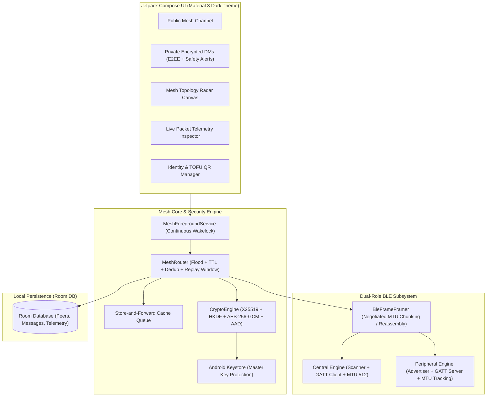
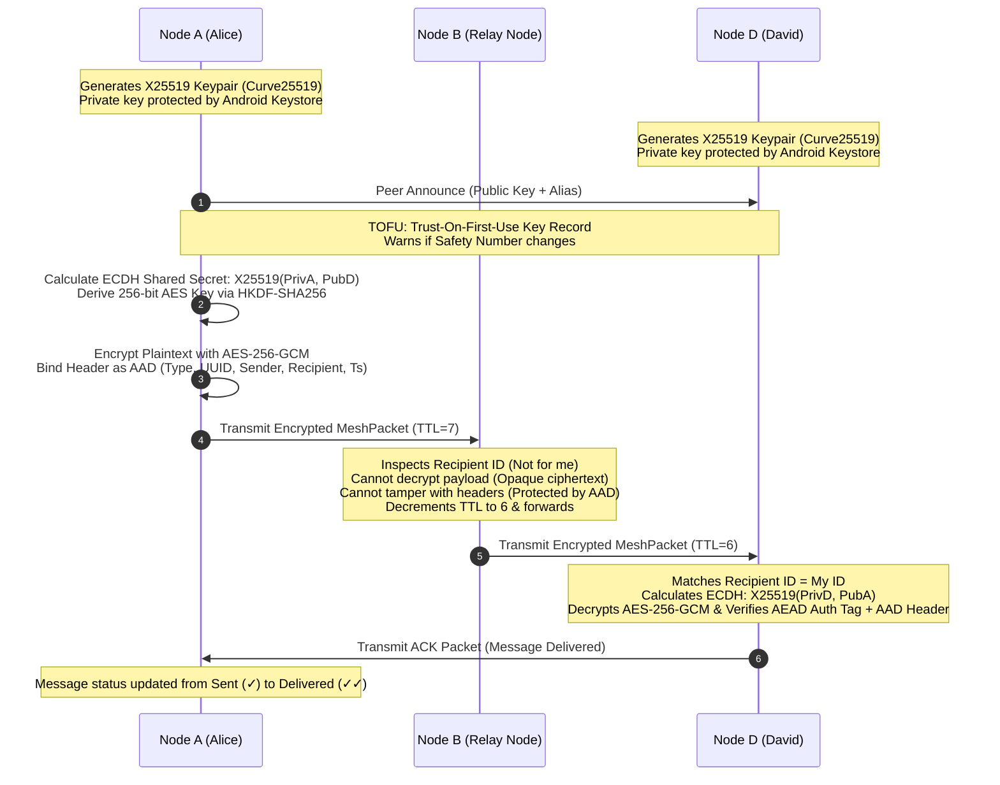

# MeshWhisper 📡⚡

**True Zero-Internet, Serverless, Peer-to-Peer Bluetooth Low Energy (BLE) Mesh Chat for Android.**

[-3DDC84.svg?style=flat&logo=android)](https://www.android.com/)
[](https://kotlinlang.org/)
[](https://developer.android.com/jetpack/compose)
[](https://www.bouncycastle.org/)
[]()

---

## 1. What is MeshWhisper?

**MeshWhisper** is a decentralized, off-grid peer-to-peer messaging application. Every phone acts as an independent **Mesh Node** — discovering other devices over Bluetooth Low Energy (BLE), forming ad-hoc connections dynamically, and relaying encrypted messages across multi-hop paths without Wi-Fi, cellular data, or central servers.

```
       [Phone A] 
       (Sender)
          │
      BLE │ (Direct link)
          ▼
   [Phone B (Relay)] ──BLE──▶ [Phone C (Relay)] ──BLE──▶ [Phone D (Recipient)]
(Cannot read payload)       (Cannot read payload)           (Decrypted locally)
```
*(Note: Complete payload secrecy across intermediate relays applies to the end-to-end encrypted `DIRECT_MESSAGE` channel. The `BROADCAST_MESSAGE` channel is encrypted with a shared mesh community key for open public rooms).*

---

## 2. Core Architecture



---

## 3. Simultaneous Dual-Role BLE & MTU Optimization

Every device runs both roles concurrently:

| Role | Component | Responsibility |
| :--- | :--- | :--- |
| **Peripheral** | `BluetoothLeAdvertiser` + `BluetoothGattServer` | Advertises custom Service UUID `0000B170...`, hosts Write (`0000B171...`) and Notify (`0000B172...`) characteristics. Tracks negotiated MTU per connected central dynamically. |
| **Central** | `BluetoothLeScanner` + `BluetoothGatt` | Continuously scans for nodes, initiates GATT connections, negotiates MTU up to 512 bytes, and subscribes to CCCD notifications. |
| **Hardware Fallback** | `FEATURE_BLUETOOTH_LE_PERIPHERAL` check | If a budget device lacks hardware peripheral mode, it seamlessly degrades to **Central Relay Mode** (scanning, connecting, and relaying without advertising). |
| **Flood/DoS Protection** | Per-Address Write Rate Limiting | Inbound GATT characteristic writes are rate-limited per remote MAC to protect the radio from spam/DoS attacks. |

---

## 4. Binary Packet Specification (Compact 56-Byte Overhead)

```
 0                   1                   2                   3
 0 1 2 3 4 5 6 7 8 9 0 1 2 3 4 5 6 7 8 9 0 1 2 3 4 5 6 7 8 9 0 1
+-+-+-+-+-+-+-+-+-+-+-+-+-+-+-+-+-+-+-+-+-+-+-+-+-+-+-+-+-+-+-+-+
|  Type (1 byte)|         Message UUID (16 bytes) ...           |
+-+-+-+-+-+-+-+-+-+-+-+-+-+-+-+-+-+-+-+-+-+-+-+-+-+-+-+-+-+-+-+-+
|                      ... Message UUID ...                     |
+-+-+-+-+-+-+-+-+-+-+-+-+-+-+-+-+-+-+-+-+-+-+-+-+-+-+-+-+-+-+-+-+
|                      Sender Node ID (8 bytes)                 |
|                                                               |
+-+-+-+-+-+-+-+-+-+-+-+-+-+-+-+-+-+-+-+-+-+-+-+-+-+-+-+-+-+-+-+-+
|                    Recipient Node ID (8 bytes)                |
|                    (0xFFFFFFFFFFFFFFFF for Broadcast)         |
+-+-+-+-+-+-+-+-+-+-+-+-+-+-+-+-+-+-+-+-+-+-+-+-+-+-+-+-+-+-+-+-+
|  TTL (1 byte) |            Timestamp (4 bytes)                |
+-+-+-+-+-+-+-+-+-+-+-+-+-+-+-+-+-+-+-+-+-+-+-+-+-+-+-+-+-+-+-+-+
|     Payload Length (2 bytes)  |   Encrypted Payload (N bytes) |
+-+-+-+-+-+-+-+-+-+-+-+-+-+-+-+-+-+-+-+-+-+-+-+-+-+-+-+-+-+-+-+-+
|                    ... Encrypted Payload ...                  |
+-+-+-+-+-+-+-+-+-+-+-+-+-+-+-+-+-+-+-+-+-+-+-+-+-+-+-+-+-+-+-+-+
|              AEAD Authentication Tag (AES-GCM, 16 bytes)      |
|                                                               |
+-+-+-+-+-+-+-+-+-+-+-+-+-+-+-+-+-+-+-+-+-+-+-+-+-+-+-+-+-+-+-+-+
```

### Packet Types:
- `0x00` — `BROADCAST_MESSAGE`: Public channel broadcast across all mesh hops (encrypted with shared mesh community key).
- `0x01` — `DIRECT_MESSAGE`: Point-to-point end-to-end encrypted 1-to-1 message (unreadable by relay nodes).
- `0x02` — `KEY_EXCHANGE`: Peer identity handshake & public key distribution.
- `0x03` — `ACK`: Cryptographic delivery receipt returning to sender.
- `0x04` — `PEER_ANNOUNCE`: Periodic heartbeat and discovery advertisement.

---

## 5. End-to-End Cryptography & WhatsApp/Signal-Grade Hardening



### Key Security Features:
1. **AEAD Additional Authenticated Data (AAD) Binding**: All immutable packet headers (`type`, `messageId`, `senderId`, `recipientId`, `timestamp`) are fed into AES-GCM as AAD. Malicious relays cannot tamper with routing headers without triggering authentication failure on the recipient.
2. **Hardware-Backed Android Keystore Master Key**: The X25519 identity private key is encrypted with an AES-256-GCM master key stored inside Android Keystore (backed by hardware TEE/SE). `android:allowBackup="false"` prevents USB extraction via `adb backup`.
3. **Safety Number / Identity Change Warnings**: If a peer's announced public key changes from what was previously stored (TOFU), MeshWhisper alerts the user with an in-chat security warning banner.
4. **Peer Blocking & Ingress Filtering**: Blocked contacts are dropped at router ingress before decryption or ACK generation.
5. **Replay Protection**: Live packets are validated against a bounded timestamp window (±10 minutes) and deduplicated via memory cache and unique message UUIDs.

---

## 6. Multi-Hop Routing & Store-and-Forward

1. **Deduplication Engine**: A high-speed LRU cache holds up to 2,000 recently observed message UUIDs. Redundant transmissions are dropped instantly, preventing broadcast storms and infinite routing loops.
2. **Hop Decrement**: Packets start with `TTL = 7`. Every relay node decrements TTL by 1 before rebroadcasting. Packets terminate at `TTL = 0`.
3. **Store-and-Forward Buffer**: If a packet is addressed to an offline or out-of-range peer, intermediate relay nodes cache the encrypted blob in a local Room DB table (24-hour expiration). When the recipient enters range and announces presence, the queue is drained and delivered automatically.

---

## 7. App Screens & UI Features

- **Public Mesh Room**: Live decentralized chat room with dynamic hop badges (`⚡ Direct` vs `⚡ 2 hops (Relayed)`).
- **Private Encrypted DMs**: 1-to-1 conversations with delivery status checkmarks (`✓` Sent, `✓✓` Delivered ACK), TOFU fingerprint verification, safety number change alerts, and contact blocking.
- **Mesh Topology Radar**: Interactive animated pulse canvas displaying concentric radar rings, center node ("YOU"), connected links, and multi-hop peers.
- **Live Packet Telemetry Inspector**: Real-time diagnostic terminal streaming raw packet events (`[TX]`, `[RX]`, `[RELAY]`, `[DROP]`, `[ACK]`), byte metrics, and direction filter chips.
- **Identity & QR Manager**: Node alias customization, 64-bit Hex ID display, X25519 fingerprint generator, and QR code generator for in-person visual verification.

---

## 8. Physical 4-Phone Hop Demonstration

```
[Phone A] <---BLE---> [Phone B (Relay)] <---BLE---> [Phone C (Relay)] <---BLE---> [Phone D]
(Sender)             (Intermediate)               (Intermediate)             (Recipient)
```

### Demonstration Steps:
1. **Enable Airplane Mode** on all 4 Android devices, then turn **Bluetooth ON** (proves zero Wi-Fi / internet / cellular connectivity).
2. Install and launch **MeshWhisper** on all 4 devices.
3. Place them in a physical line so Phone A cannot reach Phone D directly.
4. From **Phone A**, send a private direct message to **Phone D**.
5. **Verify**:
   - **Phone D** receives and decrypts the message, showing `"⚡ 3 hops (Relayed)"`.
   - **Phones B & C** log `[RELAY]` events in their Packet Inspector without being able to read the ciphertext.
   - **Phone A** receives an `ACK` packet, updating the message icon to `✓✓` (Delivered).

---

## 9. Build & Installation

### Prerequisites:
- Android Studio Ladybug / Meerkat or JDK 17+
- Android SDK 35 (Min SDK: 26 — Android 8.0 Oreo)

### Build Debug APK:
```powershell
# Run Unit Tests
./gradlew testDebugUnitTest

# Assemble Sideloadable APK
./gradlew assembleDebug
```
Output APK location: `app/build/outputs/apk/debug/app-debug.apk`.

### Sideload to Device:
```powershell
adb install -r app/build/outputs/apk/debug/app-debug.apk
```

---

## 10. License

Developed for decentralized, open off-grid communication. Apache 2.0 / MIT License.
