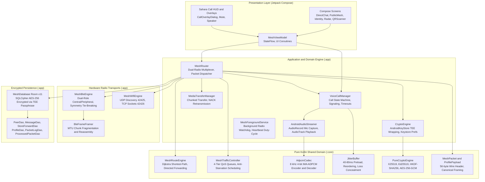
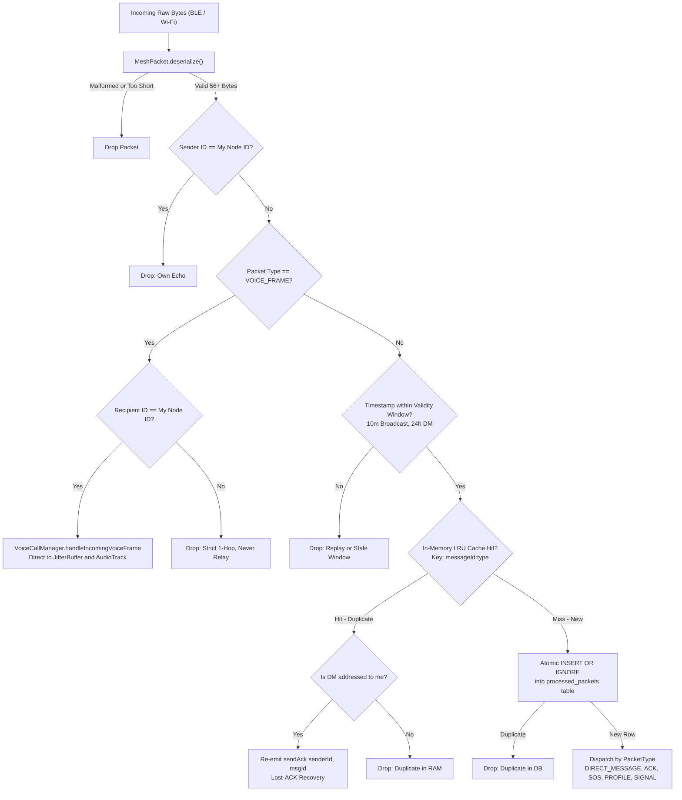
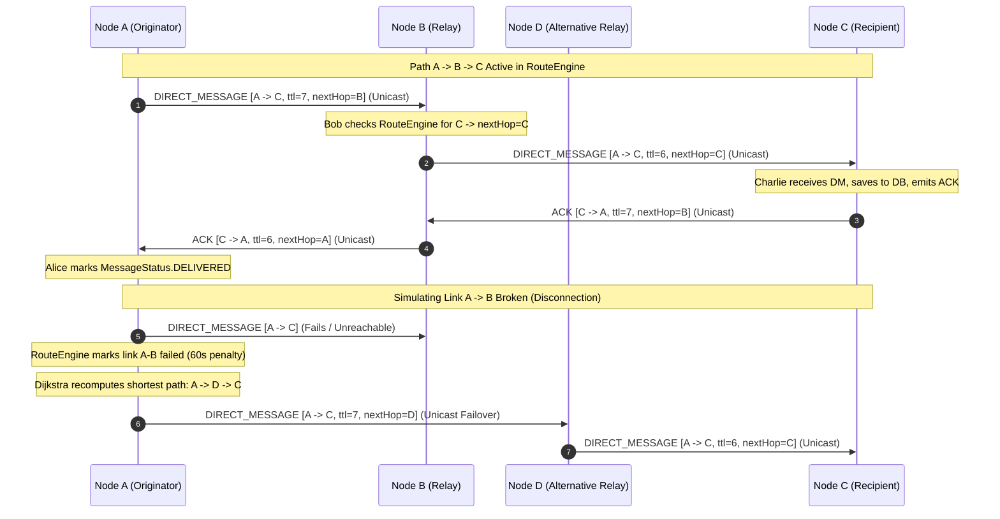
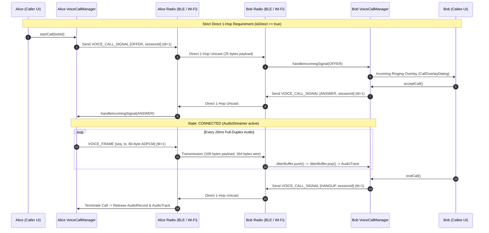

# BIT FOR US — System Architecture Specification

Version: **v1.4 (Synchronized with Codebase)**  
Last Updated: **September 2026**

---

## 1. System Overview

BIT FOR US is an **offline, infrastructure-free peer-to-peer communication system** operating over a dual-radio **Bluetooth Low Energy (BLE) + Local Wi-Fi (LAN / Hotspot)** hybrid transport.

The platform provides resilient, end-to-end encrypted messaging, dynamic multi-hop routing, traffic-prioritized delivery, signed identity profiles, emergency distress beacons, and real-time 1-hop duplex voice calling without dependence on cellular towers, internet backbones, DNS root servers, or centralized infrastructure.

---

## 2. Module Architecture & Boundaries

The codebase is partitioned into three distinct Gradle modules:

### 2.1. `:core` — Pure Kotlin JVM Library
- **Dependencies**: BouncyCastle (`bcprov-jdk18on`), standard Java cryptographic libraries (`java.security`, `java.nio`).
- **Forbidden Dependencies**: Android SDK classes (`android.*`, `androidx.*`, UI libraries).
- **Key Subsystems**:
  - `protocol/`: [MeshPacket.kt](file:///c:/Users/hp/Downloads/BIT%20FOR%20US/core/src/main/java/com/meshwhisper/core/protocol/MeshPacket.kt), [TrafficPriority.kt](file:///c:/Users/hp/Downloads/BIT%20FOR%20US/core/src/main/java/com/meshwhisper/core/protocol/TrafficPriority.kt), [ProfilePayload.kt](file:///c:/Users/hp/Downloads/BIT%20FOR%20US/core/src/main/java/com/meshwhisper/core/protocol/ProfilePayload.kt).
  - `audio/`: [AdpcmCodec.kt](file:///c:/Users/hp/Downloads/BIT%20FOR%20US/core/src/main/java/com/meshwhisper/core/audio/AdpcmCodec.kt), [JitterBuffer.kt](file:///c:/Users/hp/Downloads/BIT%20FOR%20US/core/src/main/java/com/meshwhisper/core/audio/JitterBuffer.kt).
  - `router/`: [MeshRouteEngine.kt](file:///c:/Users/hp/Downloads/BIT%20FOR%20US/core/src/main/java/com/meshwhisper/core/router/MeshRouteEngine.kt), [MeshTrafficController.kt](file:///c:/Users/hp/Downloads/BIT%20FOR%20US/core/src/main/java/com/meshwhisper/core/protocol/MeshTrafficController.kt), [LruDedupCache.kt](file:///c:/Users/hp/Downloads/BIT%20FOR%20US/core/src/main/java/com/meshwhisper/core/router/LruDedupCache.kt).
  - `crypto/`: [PureCryptoEngine.kt](file:///c:/Users/hp/Downloads/BIT%20FOR%20US/core/src/main/java/com/meshwhisper/core/crypto/PureCryptoEngine.kt).

### 2.2. `:app` — Android Application Module
- **Dependencies**: `:core`, Jetpack Compose, AndroidX Lifecycle, AndroidX Room (v11), SQLCipher, CameraX (1.4.1), Kotlin Coroutines.
- **Key Subsystems**:
  - `ble/`: [MeshBleEngine.kt](file:///c:/Users/hp/Downloads/BIT%20FOR%20US/app/src/main/java/com/meshwhisper/app/ble/MeshBleEngine.kt), [BleFrameFramer.kt](file:///c:/Users/hp/Downloads/BIT%20FOR%20US/app/src/main/java/com/meshwhisper/app/ble/BleFrameFramer.kt), [GattWriteRateLimiter.kt](file:///c:/Users/hp/Downloads/BIT%20FOR%20US/app/src/main/java/com/meshwhisper/app/ble/GattWriteRateLimiter.kt).
  - `wifi/`: [MeshWifiEngine.kt](file:///c:/Users/hp/Downloads/BIT%20FOR%20US/app/src/main/java/com/meshwhisper/app/wifi/MeshWifiEngine.kt).
  - `router/`: [MeshRouter.kt](file:///c:/Users/hp/Downloads/BIT%20FOR%20US/app/src/main/java/com/meshwhisper/app/router/MeshRouter.kt).
  - `voice/`: [VoiceCallManager.kt](file:///c:/Users/hp/Downloads/BIT%20FOR%20US/app/src/main/java/com/meshwhisper/app/voice/VoiceCallManager.kt), [AndroidAudioStreamer.kt](file:///c:/Users/hp/Downloads/BIT%20FOR%20US/app/src/main/java/com/meshwhisper/app/voice/AndroidAudioStreamer.kt), [VoiceCallSession.kt](file:///c:/Users/hp/Downloads/BIT%20FOR%20US/app/src/main/java/com/meshwhisper/app/voice/VoiceCallSession.kt).
  - `data/`: [MeshDatabase.kt](file:///c:/Users/hp/Downloads/BIT%20FOR%20US/app/src/main/java/com/meshwhisper/app/data/MeshDatabase.kt), Room DAOs and entities.
  - `ui/`: Jetpack Compose views, ViewModels, Sahara warm-minimalist design components.

### 2.3. `:desktop` — Companion Workstation Module
- **Dependencies**: `:core`, `sqlite-jdbc`.
- **Purpose**: Field station and tactical base monitoring using standard Wi-Fi LAN sockets.

---

## 3. Packet Ingestion & Processing Pipeline

Incoming raw bytes from either BLE GATT or Wi-Fi TCP sockets enter `MeshRouter.handleIncomingPacket()`:

> [!IMPORTANT]
> **Zero DB Pollution for Voice Frames**: `VOICE_FRAME` packets are intercepted *before* deduplication and database operations. They are routed directly into memory buffers and never trigger SQLite I/O.

---

## 4. Dynamic Multi-Hop Routing Architecture

The mesh employs a **dynamic shortest-path next-hop routing model** implemented in [`MeshRouteEngine.kt`](file:///c:/Users/hp/Downloads/BIT%20FOR%20US/core/src/main/java/com/meshwhisper/core/router/MeshRouteEngine.kt):

### Key Routing Engine Rules:
1. **Dijkstra Shortest Path**: Paths are computed over active physical neighbors (`updateDirectNeighbors`) and gossip topology edges (`updateEdges`).
2. **Edge Freshness**: Edges older than 120 seconds are evicted from graph calculations.
3. **Link Failure Quarantine**: When a transmission to a direct neighbor fails, `markLinkFailed(from, to)` applies a 60-second penalty to that edge, forcing the engine to find an alternative loop-free route.
4. **Relay Custody Cleanup**: Intermediate relays ($B$) only buffer messages in `store_forward_queue` if downstream links are unavailable. As soon as $B$ successfully hands the packet to next-hop $C$, $B$ deletes the message from its store-and-forward queue.
5. **Lost-ACK Recovery**: If an ACK is lost on the return path and $A$ retransmits the direct message, $C$ detects the duplicate in its deduplication cache and re-emits `sendAck(A, msgId)` without re-inserting the duplicate text into its chat history.

---

## 5. Traffic Prioritization & Quality-of-Service (QoS)

Outbound traffic is scheduled through [`MeshTrafficController.kt`](file:///c:/Users/hp/Downloads/BIT%20FOR%20US/core/src/main/java/com/meshwhisper/core/protocol/MeshTrafficController.kt), enforcing non-blocking prioritization across 4 bounded FIFO queues:

| Tier | Name | Packets Enqueued | Scheduling Policy | Max Queue |
| :---: | :--- | :--- | :--- | :---: |
| **Tier 0** | `CRITICAL_EMERGENCY` | `SOS_MESSAGE` | Zero delay; preempts all other traffic unconditionally. | 100 packets |
| **Tier 1** | `HIGH_INTERACTIVE` | `ACK`, `KEY_EXCHANGE`, `TYPING_INDICATOR`, `VOICE_CALL_SIGNAL`, `VOICE_FRAME` | Immediate scheduling; keeps UI responsive and voice frames fluid. | 100 packets |
| **Tier 2** | `STANDARD_MESSAGING` | `DIRECT_MESSAGE`, `BROADCAST_MESSAGE`, `PEER_ANNOUNCE`, `PROFILE_UPDATE`, `PROFILE_REQUEST` | Scheduled after Tier 0 & Tier 1; subject to CSMA backoff jitter. | 100 packets |
| **Tier 3** | `BULK_TRANSFER` | `MEDIA_INIT`, `MEDIA_CHUNK`, `AVATAR_REQUEST`, `MEDIA_NACK`, `MEDIA_ACK`, `MEDIA_ABORT` | Paced and throttled; preempted by any interactive or chat traffic. | 100 packets |

- **Packet Lifetime**: Packets older than 30 seconds (`maxPacketLifetimeMs`) in the queues are automatically dropped to prevent stale queue accumulation.
- **Starvation Protection**: An internal deficit scheduler ensures that under heavy interactive load, standard messaging and bulk queues continue to make progress.

---

## 6. Real-Time 1-Hop Voice Architecture

### Subsystem Components:
1. **`AdpcmCodec.kt`**: Pure Kotlin 4-bit IMA/DVI ADPCM algorithm. Compresses 160 samples (320 bytes PCM) into 80 bytes (32 kbps). Total packet size with headers is 164 bytes, fitting inside BLE ATT MTU without fragmentation.
2. **`JitterBuffer.kt`**: Bounded buffer holding 2–4 frames (40–80ms) to reorder out-of-sequence arrivals, drop duplicate or late frames, and perform packet loss concealment.
3. **`AndroidAudioStreamer.kt`**: Captures audio via `AudioRecord` (8 kHz mono, `VOICE_COMMUNICATION` with echo cancellation) and outputs audio via `AudioTrack` low-latency streaming.
4. **`VoiceCallManager.kt`**: Coordinates state transitions (`IDLE`, `OUTGOING_RINGING`, `INCOMING_RINGING`, `CONNECTED`, `ENDED`), manages 30s ringing timeouts, rejects third-party calls with `BUSY`, and auto-terminates calls if the direct radio link is disconnected (`CallEndReason.LINK_LOST`).

---

## 7. Persistence Architecture & Database Schema

Local data is stored in [`MeshDatabase.kt`](file:///c:/Users/hp/Downloads/BIT%20FOR%20US/app/src/main/java/com/meshwhisper/app/data/MeshDatabase.kt), an encrypted SQLite database using SQLCipher and AndroidX Room (Schema **Version 11**):

### Key Tables & Entities:
- **`peers`**: Known mesh contacts (Node ID, alias, public key hex, fingerprint, safety number verification status, RSSI, hop count, avatar URI/hash, mute flag).
- **`profiles`**: User profiles (Node ID, display name, bio, avatar URI/hash, monotonic version counter, Ed25519 signature, last updated).
- **`messages`**: Chat history (Message ID, sender ID, recipient ID, text, timestamp, media paths, status: `PENDING`, `SENT`, `RELAYED`, `DELIVERED`, hop count).
- **`store_forward_queue`**: Offline direct message queue (Message ID, recipient ID, raw packet blob, created timestamp, expires timestamp). Bounded to 50 messages per recipient and 500 total rows.
- **`processed_packets`**: Deduplication registry (Key: `messageId:type`, timestamp). Evaluated via atomic `INSERT OR IGNORE`.
- **`packet_logs`**: Circular diagnostic log (direction, packet type, byte size, TTL, details). Trimmed to 500 entries every 50 writes.
- **`topology_edges`**: Mesh graph edges collected via gossip for routing and radar physics.
- **`last_known_locations`**: GPS coordinates and fix timestamps for emergency homing.

---

## 8. Concurrency & Android Lifecycle

### 8.1. Coroutine Architecture
- `MeshRouter`, `MeshBleEngine`, `MeshWifiEngine`, and `AndroidAudioStreamer` each maintain independent `CoroutineScope(SupervisorJob() + Dispatchers.IO + CoroutineExceptionHandler)`.
- Critical mutable states use thread-safe data structures (`ConcurrentHashMap`, atomic primitives) or dedicated `@Synchronized` locks.

### 8.2. Background Execution & Foreground Service
- Background relaying and continuous presence heartbeats are maintained by `MeshForegroundService`.
- The service displays an ongoing notification with adaptive duty-cycling (4s heartbeat interval when peers are connected, 12s when idle).
- `MainActivity` signals `isActivityInForeground` to prevent premature radio shutdown while the user is actively viewing conversations.
