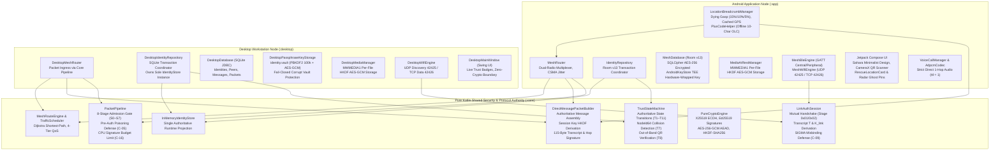

# BIT FOR US / MeshWhisper — System Architecture Specification

**Status:** FROZEN Implementation Specification  
**Architecture Version:** vNext (Phases P0–P10 Aligned)  
**Modules:** `:core`, `:app`, `:desktop`  

---

## 1. System Overview

BIT FOR US (MeshWhisper) is an **offline, infrastructure-free peer-to-peer communication system** operating across Android mobile devices and Desktop workstations (Windows / macOS).

The platform provides resilient, end-to-end encrypted messaging, dynamic multi-hop routing, traffic-prioritized delivery, signed identity profiles, emergency distress beacons, at-rest media encryption, and real-time 1-hop duplex voice calling without dependence on cellular towers, internet backbones, DNS root servers, or centralized infrastructure.

```mermaid
flowchart TB
    subgraph Core_Authority["Pure Kotlin Shared Security & Protocol Authority (:core)"]
        Pipeline["PacketPipeline<br>8-Stage Admission Gate (S0–S7)<br>Pre-Auth Poisoning Defense (C-05)<br>CPU Signature Budget Limit (C-16)"]
        LinkAuth["LinkAuthSession<br>Mutual Handshake (Stage 0x01/0x02)<br>Transcript T & K_link Derivation<br>SIGMA Misbinding Defense (C-09)"]
        TrustSM["TrustStateMachine<br>Authoritative State Transitions (T1–T11)<br>NodeId64 Collision Detection (T7)<br>Out-of-Band QR Verification (T8)"]
        DMBuilder["DirectMessagePacketBuilder<br>Authoritative Message Assembly<br>Session Key HKDF Derivation<br>115-Byte Transcript & Hop Signature"]
        Store["InMemoryIdentityStore<br>Single Authoritative Runtime Projection"]
        Crypto["PureCryptoEngine<br>X25519 ECDH, Ed25519 Signatures<br>AES-256-GCM AEAD, HKDF-SHA256"]
        Routing["MeshRouteEngine & TrafficScheduler<br>Dijkstra Shortest-Path, 4-Tier QoS"]
    end

    subgraph Android_Node["Android Application Node (:app)"]
        AndroidRouter["MeshRouter<br>Dual-Radio Multiplexer, CSMA Jitter"]
        AndroidRepo["IdentityRepository<br>Room v13 Transaction Coordinator"]
        AndroidDB["MeshDatabase (Room v13)<br>SQLCipher AES-256 Encrypted<br>AndroidKeyStore TEE Hardware-Wrapped Key"]
        AndroidMedia["MediaAtRestManager<br>MWMEDIA1 Per-File HKDF AES-GCM Storage"]
        LocationMgr["LocationBreadcrumbManager<br>Dying Gasp (15%/10%/5%), Cached GPS<br>PlusCodeHelper (Offline 10-Char OLC)"]
        AndroidTransports["MeshBleEngine (GATT Central/Peripheral)<br>MeshWifiEngine (UDP 42425 / TCP 42426)"]
        AndroidUI["Jetpack Compose UI<br>Sahara Minimalist Design, CameraX QR Scanner<br>RescueLocationCard & Radar Ghost Pins"]
        VoiceMgr["VoiceCallManager & AdpcmCodec<br>Strict Direct 1-Hop Audio (ttl = 1)"]
    end

    subgraph Desktop_Node["Desktop Workstation Node (:desktop)"]
        DesktopRouter["DesktopMeshRouter<br>Packet Ingress via Core Pipeline"]
        DesktopRepo["DesktopIdentityRepository<br>SQLite Transaction Coordinator<br>Owns Sole IdentityStore Instance"]
        DesktopDB["DesktopDatabase (SQLite JDBC)<br>Identities, Peers, Messages, Packets"]
        DesktopVault["DesktopPassphraseKeyStorage<br>identity.vault (PBKDF2 100k + AES-GCM)<br>Fail-Closed Corrupt Vault Protection"]
        DesktopMedia["DesktopMediaManager<br>MWMEDIA1 Per-File HKDF AES-GCM Storage"]
        DesktopTransports["DesktopWifiEngine<br>UDP Discovery 42425 / TCP Data 42426"]
        DesktopUI["DesktopMainWindow (Swing UI)<br>Live Trust Badges, Zero-Crypto Boundary"]
    end

    AndroidRouter --> Pipeline
    AndroidRouter --> DMBuilder
    AndroidRepo --> TrustSM
    AndroidRepo --> Store
    AndroidTransports --> LinkAuth
    AndroidRouter --> Routing
    LocationMgr --> DMBuilder
    LocationMgr --> AndroidRouter

    DesktopRouter --> Pipeline
    DesktopRouter --> DMBuilder
    DesktopRepo --> TrustSM
    DesktopRepo --> Store
    DesktopTransports --> LinkAuth
    DesktopRouter --> Routing
```

---

## 2. Module Architecture & Architectural Boundaries

The codebase is partitioned into three distinct Gradle modules adhering to strict dependency and architectural rules:

### 2.1. `:core` — Pure Kotlin Shared Domain Library
- **Dependencies**: Kotlin Stdlib, Coroutines, BouncyCastle (`bcprov-jdk18on`).
- **Forbidden Dependencies**: Android SDK classes (`android.*`, `androidx.*`, UI frameworks, SQLite drivers).
- **Key Responsibilities**:
  - `protocol/`: [MeshPacket.kt](file:///c:/Users/hp/Downloads/BIT%20FOR%20US/core/src/main/java/com/meshwhisper/core/protocol/MeshPacket.kt), [PacketPipeline.kt](file:///c:/Users/hp/Downloads/BIT%20FOR%20US/core/src/main/java/com/meshwhisper/core/protocol/PacketPipeline.kt), [DirectMessagePacketBuilder.kt](file:///c:/Users/hp/Downloads/BIT%20FOR%20US/core/src/main/java/com/meshwhisper/core/protocol/DirectMessagePacketBuilder.kt), [LocationBreadcrumbPayload.kt](file:///c:/Users/hp/Downloads/BIT%20FOR%20US/core/src/main/java/com/meshwhisper/core/protocol/LocationBreadcrumbPayload.kt), [TrafficPriority.kt](file:///c:/Users/hp/Downloads/BIT%20FOR%20US/core/src/main/java/com/meshwhisper/core/protocol/TrafficPriority.kt).
  - `transport/`: [LinkAuth.kt](file:///c:/Users/hp/Downloads/BIT%20FOR%20US/core/src/main/java/com/meshwhisper/core/transport/LinkAuth.kt), [WifiFrameCodec.kt](file:///c:/Users/hp/Downloads/BIT%20FOR%20US/core/src/main/java/com/meshwhisper/core/transport/WifiFrameCodec.kt).
  - `identity/`: [TrustStateMachine.kt](file:///c:/Users/hp/Downloads/BIT%20FOR%20US/core/src/main/java/com/meshwhisper/core/identity/TrustStateMachine.kt), [IdentityManager.kt](file:///c:/Users/hp/Downloads/BIT%20FOR%20US/core/src/main/java/com/meshwhisper/core/identity/IdentityManager.kt), [IdentityStore.kt](file:///c:/Users/hp/Downloads/BIT%20FOR%20US/core/src/main/java/com/meshwhisper/core/identity/IdentityStore.kt).
  - `crypto/`: [PureCryptoEngine.kt](file:///c:/Users/hp/Downloads/BIT%20FOR%20US/core/src/main/java/com/meshwhisper/core/crypto/PureCryptoEngine.kt).
  - `router/`: [MeshRouteEngine.kt](file:///c:/Users/hp/Downloads/BIT%20FOR%20US/core/src/main/java/com/meshwhisper/core/router/MeshRouteEngine.kt), [MeshTrafficController.kt](file:///c:/Users/hp/Downloads/BIT%20FOR%20US/core/src/main/java/com/meshwhisper/core/protocol/MeshTrafficController.kt), [LruDedupCache.kt](file:///c:/Users/hp/Downloads/BIT%20FOR%20US/core/src/main/java/com/meshwhisper/core/router/LruDedupCache.kt).
  - `audio/`: [AdpcmCodec.kt](file:///c:/Users/hp/Downloads/BIT%20FOR%20US/core/src/main/java/com/meshwhisper/core/audio/AdpcmCodec.kt), [JitterBuffer.kt](file:///c:/Users/hp/Downloads/BIT%20FOR%20US/core/src/main/java/com/meshwhisper/core/audio/JitterBuffer.kt).

### 2.2. `:app` — Android Application Module
- **Dependencies**: `:core`, AndroidX Jetpack Compose, AndroidX Room (v13), SQLCipher, CameraX (1.4.1), Kotlin Coroutines.
- **Key Responsibilities**:
  - `ble/`: `MeshBleEngine.kt` (GATT Central/Peripheral, max 5 links), `BleFrameFramer.kt` (MTU chunking), `GattWriteRateLimiter.kt`.
  - `wifi/`: `MeshWifiEngine.kt` (UDP beacon discovery on 42425, TCP server/client on 42426, max 5 sessions).
  - `router/`: `MeshRouter.kt` (multiplexer, CSMA backoff, custody coordination, breadcrumb ingress).
  - `location/`: `LocationBreadcrumbManager.kt` (level-crossing battery hysteresis, active GPS caching, manual SOS & revoke).
  - `util/`: `PlusCodeHelper.kt` (100% offline 10-char Open Location Code encoder).
  - `identity/`: `IdentityRepository.kt` (coordinates Room v13 with `TrustStateMachine`).
  - `storage/`: `MediaAtRestManager.kt` (`MWMEDIA1` per-file HKDF AES-GCM media storage).
  - `data/`: `MeshDatabase.kt` (Room v13 encrypted via SQLCipher and AndroidKeyStore, `MIGRATION_12_13`).
  - `voice/`: `VoiceCallManager.kt`, `AndroidAudioStreamer.kt` (`AudioRecord` + `AudioTrack`).
  - `ui/`: Compose screens, Sahara design tokens, `RescueLocationCard.kt`, CameraX QR verification scanner.

### 2.3. `:desktop` — Companion Workstation Module
- **Dependencies**: `:core`, Kotlin Stdlib, Coroutines, BouncyCastle, `org.xerial:sqlite-jdbc` (3.47.1.0).
- **Forbidden Dependencies (T-ARCH-01)**: `android.*`, AndroidX, Jetpack Compose, Room, SQLCipher.
- **Key Responsibilities**:
  - `wifi/`: `DesktopWifiEngine.kt` (pure JVM UDP 42425 discovery, TCP 42426 data stream, max 5 sessions).
  - `router/`: `DesktopMeshRouter.kt` (delegates packet ingestion to `:core` `PacketPipeline`).
  - `identity/`: `DesktopIdentityRepository.kt` (manages SQLite identities/peers and owns sole `InMemoryIdentityStore`).
  - `crypto/`: `DesktopPassphraseKeyStorage.kt` (fail-closed PBKDF2 AES-GCM `identity.vault`), `DesktopPipelineFactory.kt`.
  - `media/`: `DesktopMediaManager.kt` (`MWMEDIA1` at-rest encryption parity).
  - `db/`: `DesktopDatabase.kt` (embedded SQLite matching Room v12 schema, collision-safe `getUniqueIdentityByNodeId`).
  - `ui/`: `DesktopMainWindow.kt` (Swing UI with live trust state badges `[VERIFIED]`, `[LINKED]`, `[SEEN]`).

---

## 3. Persistent Database Architecture (Room v13 / SQLite Schema)

Android (`MeshDatabase` Room v13) and Desktop (`DesktopDatabase` SQLite) schemas:

### Core Tables & Schemas
1. **`identities`**: Authoritative store for all discovered identities:
   - `identityHashHex` (PRIMARY KEY, 64-char hex)
   - `ikPubHex` (64-char hex)
   - `ekPubHex` (64-char hex)
   - `keyVersion` (Long)
   - `lastAnnounceCounter` (Long)
   - `trustState` (TEXT: `SEEN`, `LINKED`, `IMPORTED`, `VERIFIED`, `CONFLICTED`, `BLOCKED`, `LEGACY_UNVERIFIED`)
   - `nodeId64` (Long)
   - `alias` (TEXT)
   - `createdAt`, `lastSeenAt` (Timestamps)
2. **`peers`**: Live routing and contact view:
   - `nodeId` (PRIMARY KEY, Long)
   - `identityHashHex` (TEXT)
   - `publicKeyHex` (TEXT)
   - `alias` (TEXT)
   - `trustState` (TEXT)
   - `isVerified` (Int: derived 1 if `VERIFIED`, 0 otherwise)
   - `isBlocked` (Int: derived 1 if `BLOCKED`, 0 otherwise)
   - `hasKeyChanged` (Int: 1 if key rotation detected, 0 otherwise)
   - `keyVersion` (Long)
   - `shareLocationWithContact` (Int: 1 if user opted-in to share location, default 0; added in Room v13)
3. **`messages`**: Chat and distress message history:
   - `messageId` (PRIMARY KEY, TEXT)
   - `senderNodeId`, `recipientNodeId` (Long)
   - `text` (TEXT)
   - `timestamp` (Long)
   - `mediaType`, `mediaUri`, `mediaSizeBytes` (Added in Room v12 / `MIGRATION_11_12`)
4. **`last_known_locations`**: Latest location record per peer (Room v13):
   - `nodeId` (PRIMARY KEY, Long)
   - `latitude`, `longitude` (Double)
   - `altitude` (Double)
   - `accuracy` (Float)
   - `timestamp` (Long: hardware GPS satellite fix time)
   - `sequenceNumber` (Long: monotonic sender sequence)
   - `receivedTimestamp` (Long: receiver local arrival time)
   - `batteryPercent` (Int)
   - `triggerType` (TEXT)
   - `note` (TEXT)
5. **`breadcrumb_history`**: Store-and-forward historical location trail (Room v13):
   - `id` (PRIMARY KEY AUTOINCREMENT, Long)
   - `nodeId` (Long)
   - `sequenceNumber` (Long)
   - `latitude`, `longitude`, `altitude` (Double)
   - `accuracy` (Float)
   - `timestamp` (Long)
   - `receivedTimestamp` (Long)
   - `batteryPercent` (Int)
   - `triggerType` (TEXT)
   - `note` (TEXT)
   - Unique Index: `(nodeId, sequenceNumber)`
6. **`processed_packets`**: Single authoritative deduplication table ($C\text{-}05$):
   - `packetDedupKey` (PRIMARY KEY, TEXT: `messageId:packetTypeCode`)
   - `seenAt` (Long)
7. **`store_forward`**: Bounded custody queue (max 50/peer, 500 total, 24h expiry).
8. **`topology_edges`**: Gossiped neighbor graph for Dijkstra shortest-path calculations.

---

## 4. Architectural Invariant Enforcement (T-ARCH-01)

The build enforces strict architectural boundaries:
- `:desktop` source code contains zero imports from `android.*` or `androidx.*`.
- `DesktopMainWindow` contains zero direct cryptographic logic or `PureCryptoEngine` references.
- All direct messages across both Android and Desktop are constructed exclusively through [`DirectMessagePacketBuilder`](file:///c:/Users/hp/Downloads/BIT%20FOR%20US/core/src/main/java/com/meshwhisper/core/protocol/DirectMessagePacketBuilder.kt).
- Trust state mutations are gated exclusively through `IdentityManager` and `TrustStateMachine`.
