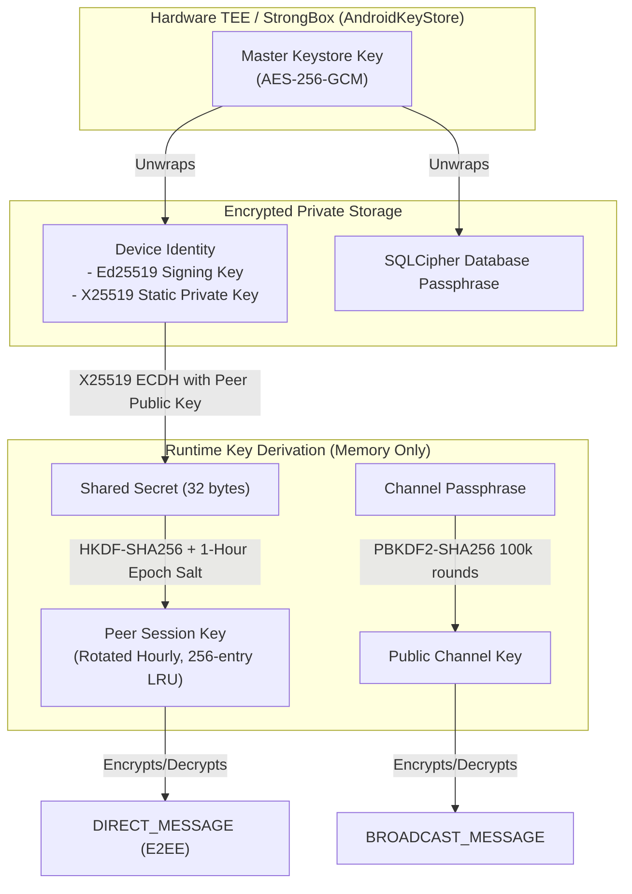

# BIT FOR US — Cryptography & Security Specification

Version: **v1.4 (Synchronized with Codebase)**  
Last Updated: **September 2026**

---

## 1. Cryptographic Primitives & Standards

BIT FOR US uses modern, standard cryptographic primitives without custom or proprietary ciphers. All mathematical operations are implemented using BouncyCastle on pure JVM (`:core`) and Android KeyStore hardware backing (`:app`).

| Primitive | Standard / RFC | Key Size | Implementation Class | Purpose |
| :--- | :--- | :---: | :--- | :--- |
| **X25519** | RFC 7748 | 256-bit | `PureCryptoEngine.kt` | Elliptic-curve Diffie-Hellman (ECDH) key agreement for unicast messaging. |
| **Ed25519** | RFC 8032 | 256-bit | `PureCryptoEngine.kt` | Digital signatures on presence beacons, SOS distress alerts, and profile updates. |
| **AES-256-GCM** | NIST SP 800-38D | 256-bit | `PureCryptoEngine.kt` | Authenticated Encryption with Associated Data (AEAD) using 96-bit random IVs and 128-bit auth tags. |
| **HKDF-SHA256** | RFC 5869 | 256-bit | `PureCryptoEngine.kt` | Key derivation for peer-to-peer session keys, refreshed on 1-hour epochs. |
| **PBKDF2-HMAC-SHA256** | RFC 2898 | 256-bit | `PureCryptoEngine.kt` | Channel key derivation from passphrases using 100,000 iterations and salt. |
| **SHA-256** | FIPS 180-4 | 256-bit | `MessageDigest` | Chunked media integrity verification and avatar hashing. |
| **SQLCipher** | AES-256-CBC | 256-bit | `MeshDatabase.kt` | Hardware-wrapped encrypted SQLite persistence for all local tables. |
| **AndroidKeyStore** | Hardware TEE / SE | 256-bit | `CryptoEngine.kt` | Hardware-isolated AES-GCM master key protecting local credentials and database passphrases. |

---

## 2. Key Hierarchy & Lifecycle



### 2.1. Node ID Derivation
A node's 64-bit address (`Node ID: Long`) is cryptographically bound to its Ed25519 identity:
```kotlin
val digest = MessageDigest.getInstance("SHA-256").digest(ed25519PublicKeyBytes)
val buffer = ByteBuffer.wrap(digest).order(ByteOrder.BIG_ENDIAN)
val nodeId = buffer.getLong()
```
An attacker cannot spoof or claim an arbitrary Node ID without possessing the corresponding private key matching the public key that derives it.

### 2.2. Session Key Epoch Rotation
Direct messages use pairwise session keys derived via:
$$\text{SessionKey} = \text{HKDF-Expand}(\text{HKDF-Extract}(\text{ECDH}(sk_A, pk_B)), \text{info} = \text{epoch})$$
where $\text{epoch} = \lfloor \text{timestamp} / 3600 \rfloor$.
This bounds the cryptographic exposure of any single session key to 1 hour. To minimize expensive curve multiplications during chat bursts, derived session keys are cached in a bounded in-memory LRU cache of capacity 256.

---

## 3. Trust Model & Identity Verification

### 3.1. Trust-On-First-Use (TOFU) with Key Rotation Alerts
1. When a node discovers a peer for the first time via `PEER_ANNOUNCE`, it records the peer's public key and fingerprint in the encrypted database.
2. If a subsequent announcement arrives claiming the same Node ID or alias but presenting a *different* public key, `MeshRouter` immediately:
   - Rejects silent key replacement.
   - Flags `hasKeyChanged = true` on the peer entity.
   - Invalidates all cached session keys for that peer.
   - Surfaces a high-priority **Security Warning Banner** in the direct chat UI:  
     `"SECURITY WARNING: SAFETY NUMBER CHANGED"`.

### 3.2. Out-of-Band Safety Number Verification
To achieve cryptographic certainty against active Man-in-the-Middle (MITM) relay attacks:
- Each peer pair generates a deterministic **60-digit / 12-group Safety Number** calculated from the sorted concatenation of both nodes' public keys.
- Users can visually compare safety numbers or scan each other's screen using the built-in **CameraX QR Scanner**.
- Once verified, the peer is stamped with `isVerified = true`, displaying a verified green shield badge in the chat UI.

---

## 4. Profile Anti-Rollback Architecture

User profiles (display name, bio, avatar hash) are strictly decoupled from the underlying cryptographic Node ID. To prevent malicious relays from reverting a user's profile to an older state, profile broadcasts enforce monotonic versioning:

1. Every profile update carries a 64-bit monotonically increasing `version` counter.
2. The entire payload (`PROF` magic, version, node ID, display name, bio, avatar hash) is signed by the user's Ed25519 identity key.
3. Receiving nodes verify the signature using the peer's stored public key.
4. **Anti-Rollback Rule**: If $\text{version} \le \text{storedVersion}$, the update is discarded immediately as stale or replayed.

---

## 5. Panic Wipe (Zero-Trace Storage Erasure)

In tactical or hostile physical seizure scenarios, the user can trigger the **Emergency Station Wipe**:
1. Closes active Room database connections.
2. Securely overwrites and deletes the SQLite database, WAL file (`-wal`), and shared-memory file (`-shm`).
3. Deletes the master key alias from the Android KeyStore hardware provider.
4. Clears all private SharedPreferences and cached avatar files from the application directory.
5. Immediately terminates the application process via `Process.killProcess(Process.myPid())`.

---

## 6. Threat Model & Mitigation Matrix

| Threat | Attack Vector | Codebase Mitigation | Remaining Risk |
| :--- | :--- | :--- | :--- |
| **Passive Eavesdropping** | RF sniffing of BLE advertisements or Wi-Fi packets. | Direct messages are encrypted with AES-256-GCM. Public broadcasts require channel passphrase. | Metadata (sender/recipient Node IDs, timestamps, hop counts) is transmitted in clear header. |
| **Ciphertext Tampering** | Bit-flipping ciphertext in transit over radio links. | AES-GCM 128-bit authentication tag verified over entire packet; invalid tags are dropped. | None; tampering results in immediate cryptographic rejection. |
| **Header Substitution** | Modifying recipient ID to redirect packets to another node. | Additional Authenticated Data (AAD) binds the 40-byte header to the ciphertext tag. | None; altering recipient ID breaks tag verification. |
| **Replay Attacks** | Capturing and replaying legitimate direct messages. | 24-hour timestamp validity window + atomic `INSERT OR IGNORE` in `processed_packets` table. | Packets replayed within seconds before LRU eviction can trigger duplicate delivery ACK. |
| **Sybil Node ID Spoofing** | Attacker claims a victim's Node ID in announcements. | Node ID is mathematically derived from Ed25519 public key. Announcement requires valid Ed25519 signature. | None; forged signatures are rejected before peer insertion. |
| **Profile Rollback** | Malicious relay sends an old profile update. | Monotonically increasing version counter signed by Ed25519; versions $\le$ current are dropped. | None; replay of old updates is detected and discarded. |
| **Rogue Relay Drop / Blackhole** | Malicious intermediate relay drops forwarded packets. | Sender tracks delivery ACKs. Link failure detection triggers automatic reroute failover ($A \to D \to C$). | If all paths through the mesh contain adversarial nodes, messages will buffer until direct link. |
| **Connection Exhaustion** | Flooding GATT server or Wi-Fi port with connections. | `MAX_CONCURRENT_GATT_CONNECTIONS = 5`, `MAX_CONCURRENT_WIFI_CONNECTIONS = 8`, rate limits (50/sec). | Attacker can exhaust available connection slots for nearby peers on the same radio. |
| **Flash Wearout via Voice Frames** | Flooding high-frequency voice frames to trigger DB I/O. | Real-time voice frames (`VOICE_FRAME`) are intercepted by fast-path and bypass SQLite DB. | Memory allocation if frame buffer overflows (bounded by `JitterBuffer` capacity of 8 frames). |
| **Physical Device Extraction** | Forensic extraction of flash memory from seized device. | SQLCipher encryption with AES-256 key wrapped in hardware TEE (AndroidKeyStore). | Cold-boot attacks or devices compromised by hardware rootkits prior to seizure. |
| **RF Jamming** | Wideband RF noise saturating 2.4 GHz spectrum. | Dual-radio diversity: can switch between BLE and local Wi-Fi LAN sockets. | High-power RF barrage can jam both 2.4 GHz radios within physical line-of-sight. |
